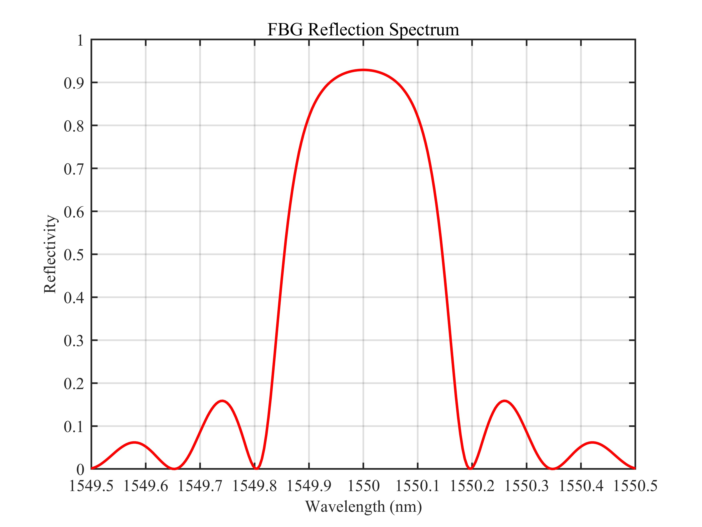
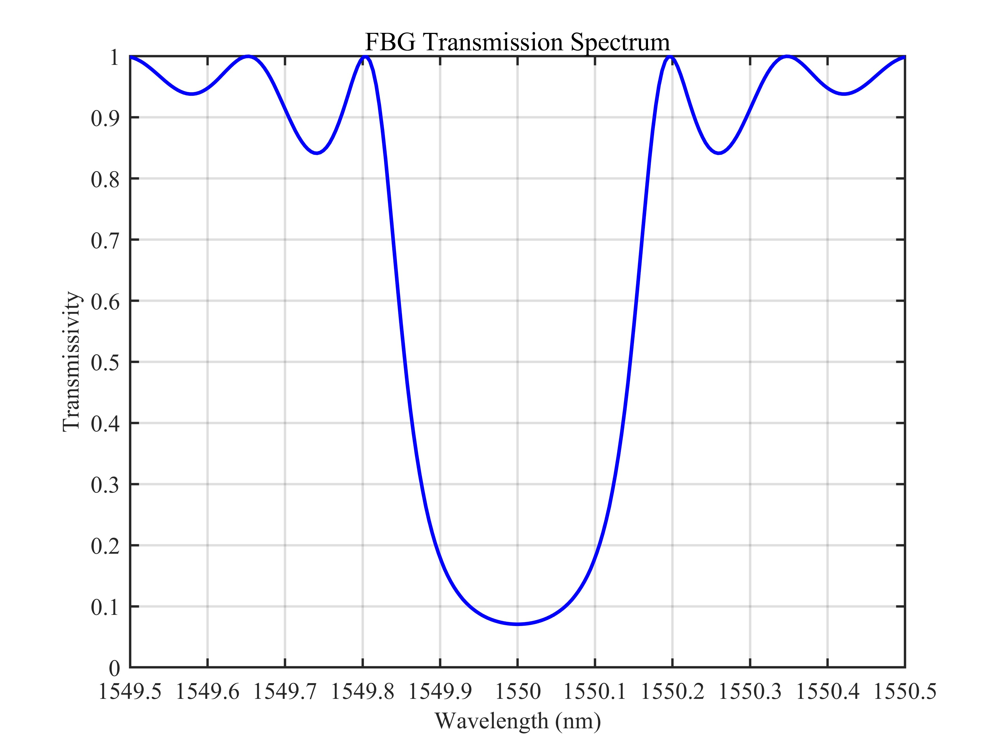
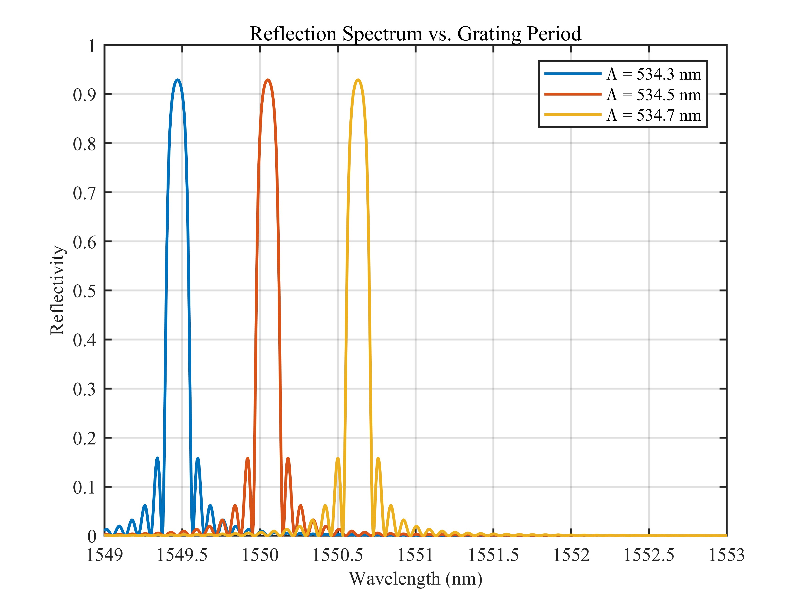
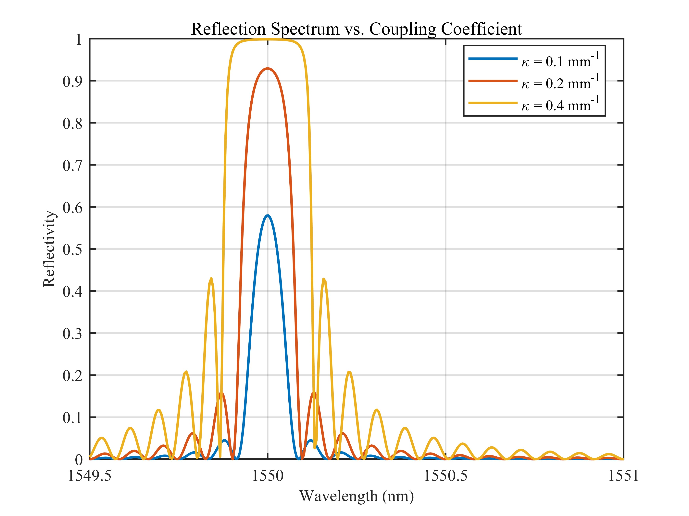
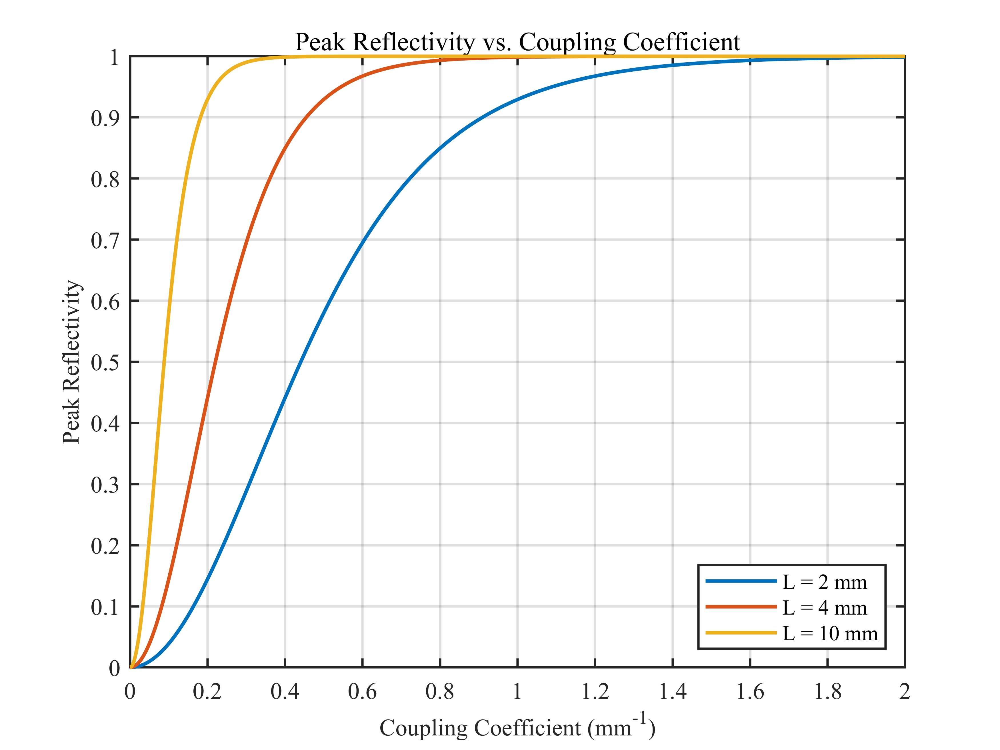
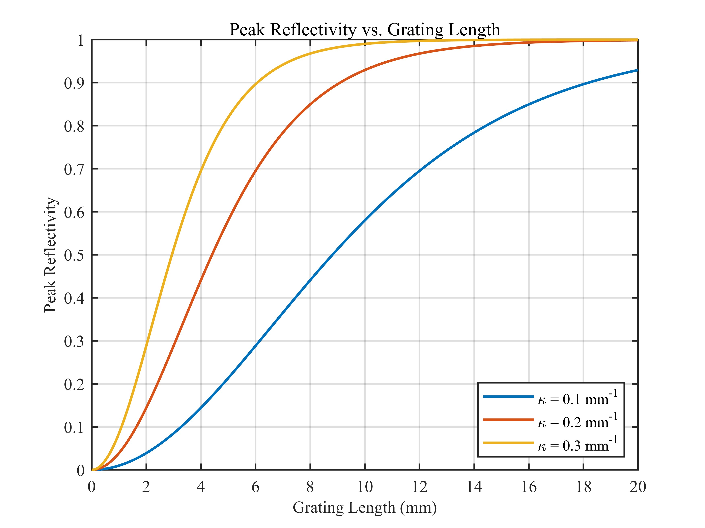

# 光纤布拉格光栅 (FBG) 反射谱与透射谱仿真 / Fiber Bragg Grating (FBG) Reflection and Transmission Spectra Simulation

## 1. 原理概述 / Principle

光纤布拉格光栅 (Fiber Bragg Grating, FBG) 是一段光纤纤芯内具有周期性折射率调制的无源光器件。当宽带光入射时，满足布拉格条件 $\lambda_B = 2 n_{\text{eff}} \Lambda$ 的波长分量会被反射，其余波长透射，形成带阻滤波特性。FBG 广泛应用于光纤通信、光纤传感和微波光子学等领域。

A Fiber Bragg Grating (FBG) is a passive optical device with periodic refractive index modulation along the fiber core. When broadband light is launched, the wavelength component satisfying the Bragg condition $\lambda_B = 2 n_{\text{eff}} \Lambda$ is reflected while the rest is transmitted, forming a bandstop filter. FBGs are widely used in fiber-optic communications, fiber sensing, and microwave photonics.

### 核心公式 / Core Equations

**布拉格条件 / Bragg Condition:**

$$
\lambda_B = 2 n_{\text{eff}} \Lambda
$$

其中 $n_{\text{eff}}$ 为光纤有效折射率，$\Lambda$ 为光栅周期。

where $n_{\text{eff}}$ is the effective refractive index and $\Lambda$ is the grating period.

**相位失配因子 / Phase Detuning:**

$$
\delta = 2\pi n_{\text{eff}} \left(\frac{1}{\lambda} - \frac{1}{\lambda_B}\right)
$$

其中 $\lambda$ 为当前波长，$\lambda_B$ 为布拉格波长。

where $\lambda$ is the current wavelength and $\lambda_B$ is the Bragg wavelength.

**有效传播常数 / Effective Propagation Constant:**

$$
\gamma = \begin{cases}
\sqrt{\kappa^2 - \delta^2}, & |\kappa| \geq |\delta| \quad (\text{带内 / inside band}) \\[4pt]
j\sqrt{\delta^2 - \kappa^2}, & |\kappa| < |\delta| \quad (\text{带外 / outside band})
\end{cases}
$$

其中 $\kappa$ 为交流耦合系数。

where $\kappa$ is the AC coupling coefficient.

**均匀 FBG 传输矩阵 / Uniform FBG Transfer Matrix:**

$$
\mathbf{T} = \begin{bmatrix}
s_{11} & s_{12} \\[2pt]
s_{21} & s_{22}
\end{bmatrix}
$$

$$
s_{11} = \cosh(\gamma L) - j\frac{\delta}{\gamma}\sinh(\gamma L)
$$

$$
s_{12} = -j\frac{\kappa}{\gamma}\sinh(\gamma L)
$$

$$
s_{21} = j\frac{\kappa}{\gamma}\sinh(\gamma L)
$$

$$
s_{22} = \cosh(\gamma L) + j\frac{\delta}{\gamma}\sinh(\gamma L)
$$

其中 $L$ 为光栅长度。

where $L$ is the grating length.

**反射率与透射率 / Reflectivity and Transmissivity:**

$$
R = |r|^2, \qquad r = \frac{T_{21}}{T_{11}}, \qquad T = 1 - R
$$

**峰值反射率（$\delta = 0$ 时）/ Peak Reflectivity (at $\delta = 0$):**

$$
R_{\text{max}} = \tanh^2(\kappa L)
$$

---

## 2. 关键参数 / Key Parameters

| 参数 / Parameter | 符号 / Symbol | 典型值 / Value | 说明 / Description |
|------|------|------|------|
| 有效折射率 | $n_{\text{eff}}$ | 1.45 | 光纤有效折射率 / Effective refractive index of fiber |
| 布拉格波长 | $\lambda_B$ | 1550 nm | 中心布拉格波长 / Center Bragg wavelength |
| 默认光栅长度 | $L$ | 5 / 10 mm | 光栅物理长度 / Physical length of grating |
| 耦合系数 | $\kappa$ | 200 ~ 400 m$^{-1}$ | 折射率调制强度 / Refractive index modulation strength |
| 归一化耦合强度 | $\kappa L$ | 1 ~ 4 | 无量纲耦合强度 / Normalized coupling strength |
| 光栅周期 | $\Lambda$ | 534.3 ~ 534.7 nm | 折射率调制周期 / Period of index modulation |

---

## 3. 仿真结果 / Simulation Results

> 所有仿真基于耦合模理论的传输矩阵法，光纤有效折射率 $n_{\text{eff}} = 1.45$。
>
> All simulations are based on the transfer matrix method of coupled-mode theory with $n_{\text{eff}} = 1.45$.

### 3.1 反射谱 / Reflection Spectrum

> $\lambda_B = 1550$ nm, $\kappa L = 2$, $L = 5$ mm

### 3.2 透射谱 / Transmission Spectrum

> $\lambda_B = 1550$ nm, $\kappa L = 2$, $L = 5$ mm

### 3.3 不同光栅周期下的反射谱 / Reflection Spectrum vs. Grating Period

> $L = 10$ mm, $\kappa L = 2$, $\Lambda = 534.3$ / $534.5$ / $534.7$ nm

### 3.4 不同耦合系数下的反射谱 / Reflection Spectrum vs. Coupling Coefficient

> $L = 10$ mm, $\lambda_B = 1550$ nm, $\kappa L = 1$ / $2$ / $4$

### 3.5 峰值反射率与耦合系数的关系 / Peak Reflectivity vs. Coupling Coefficient

> $R_{\text{max}} = \tanh^2(\kappa L)$, $L = 2$ / $4$ / $10$ mm

### 3.6 峰值反射率与光栅长度的关系 / Peak Reflectivity vs. Grating Length

> $R_{\text{max}} = \tanh^2(\kappa L)$, $\kappa = 0.1$ / $0.2$ / $0.3$ mm$^{-1}$

---

*更多算法请返回 [F:\GitHub](../../../README.md).*
