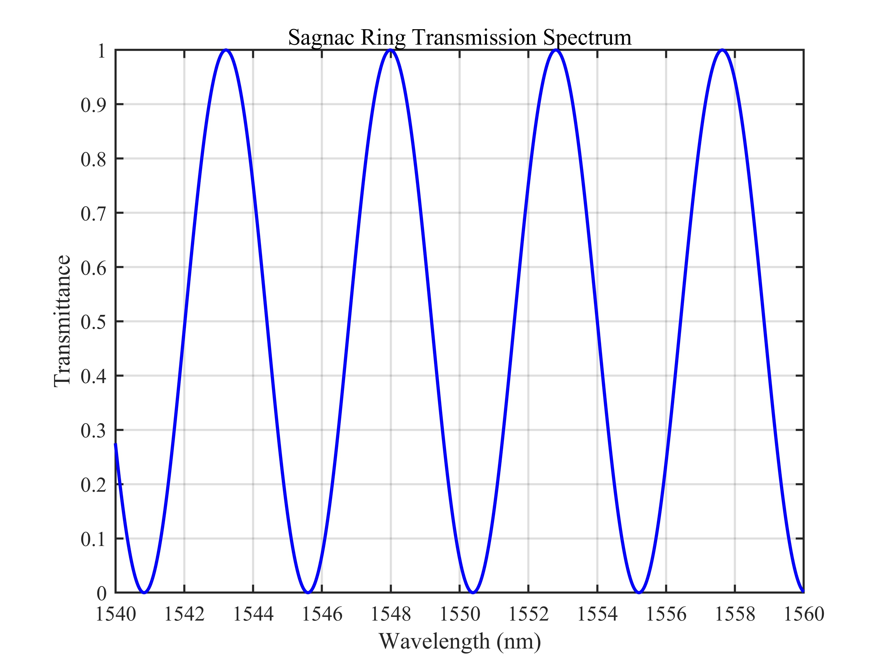
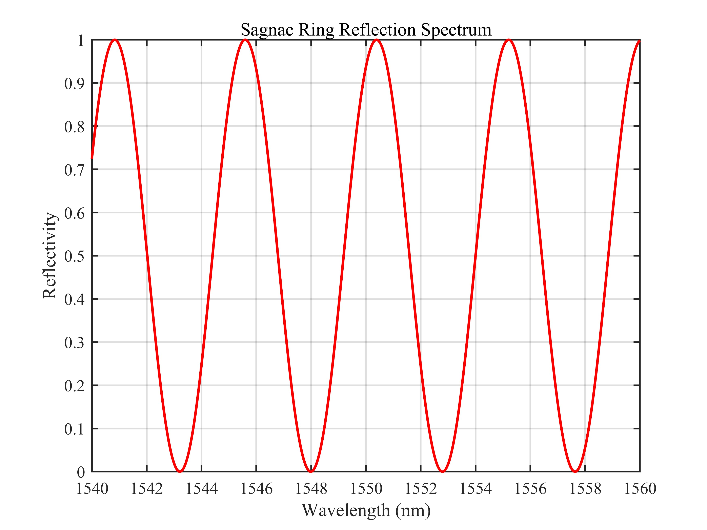
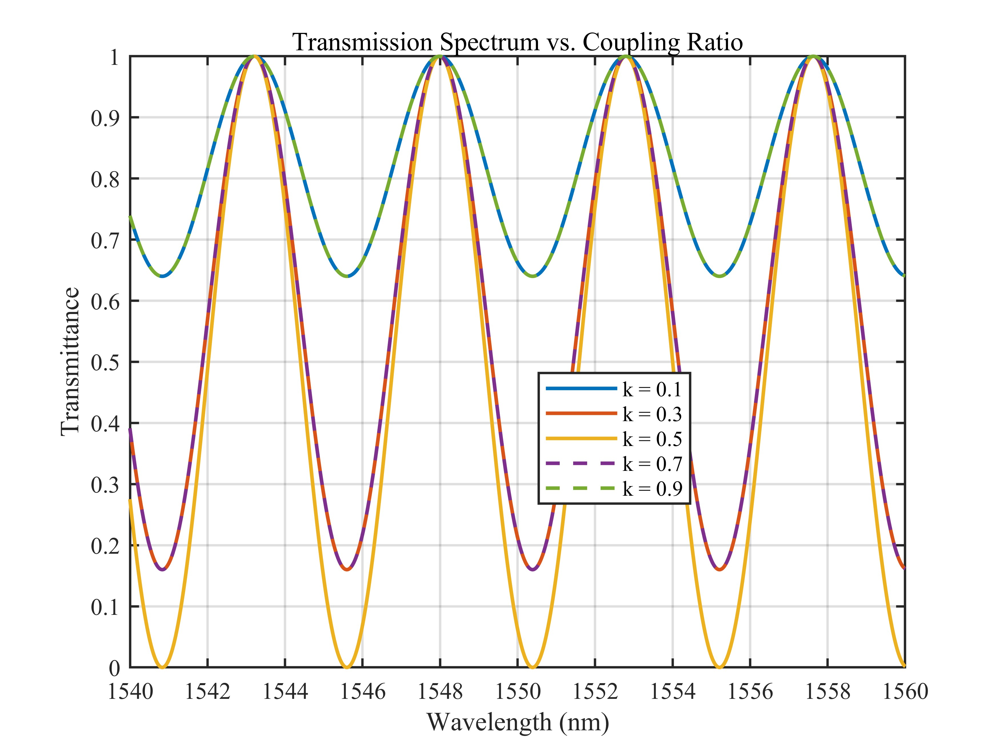
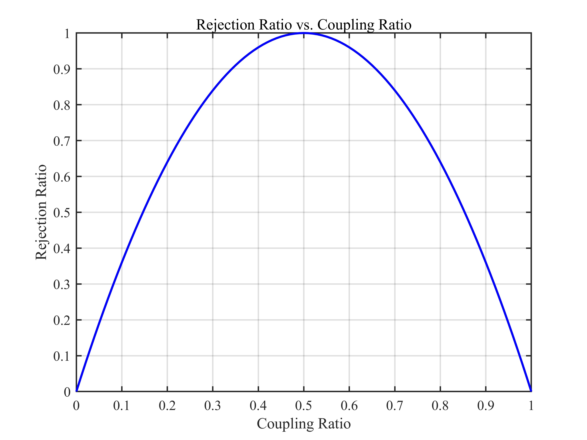
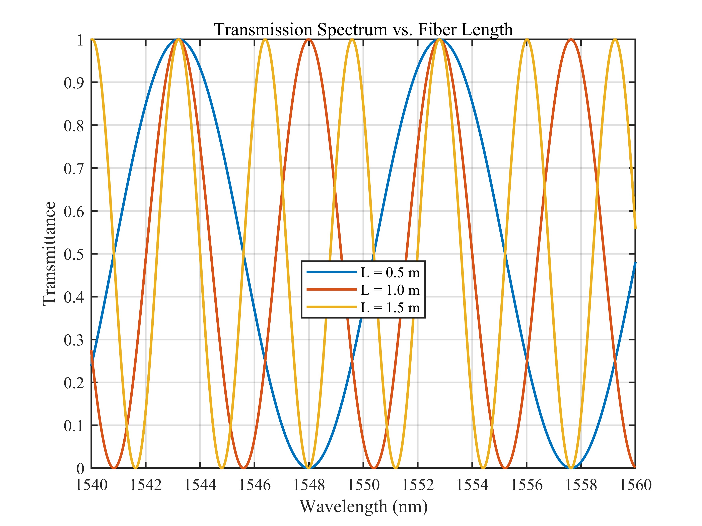
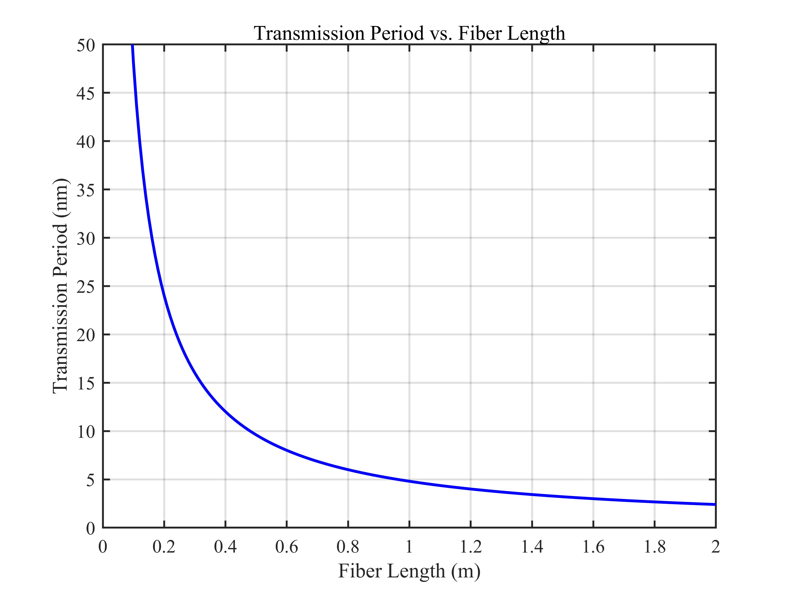
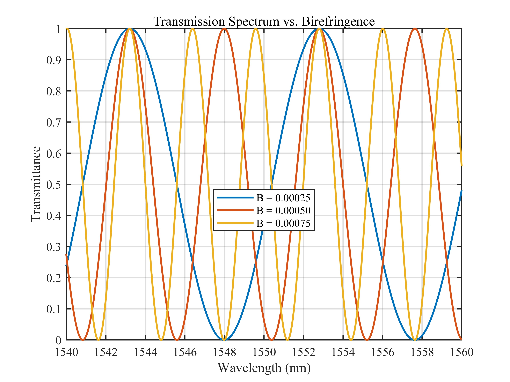
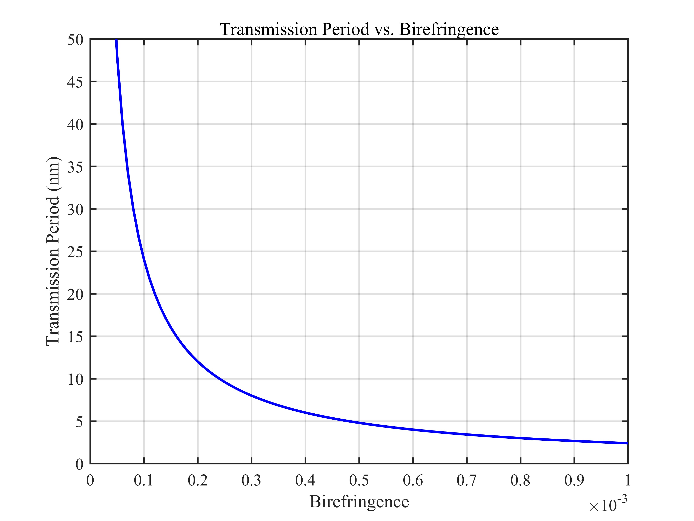
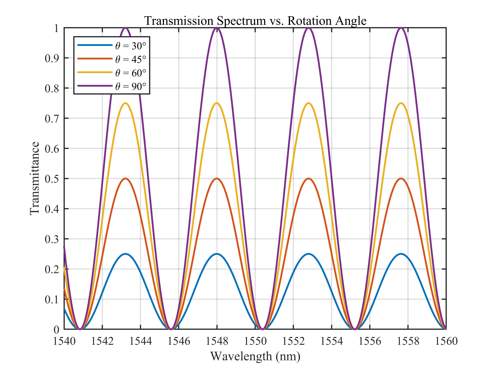
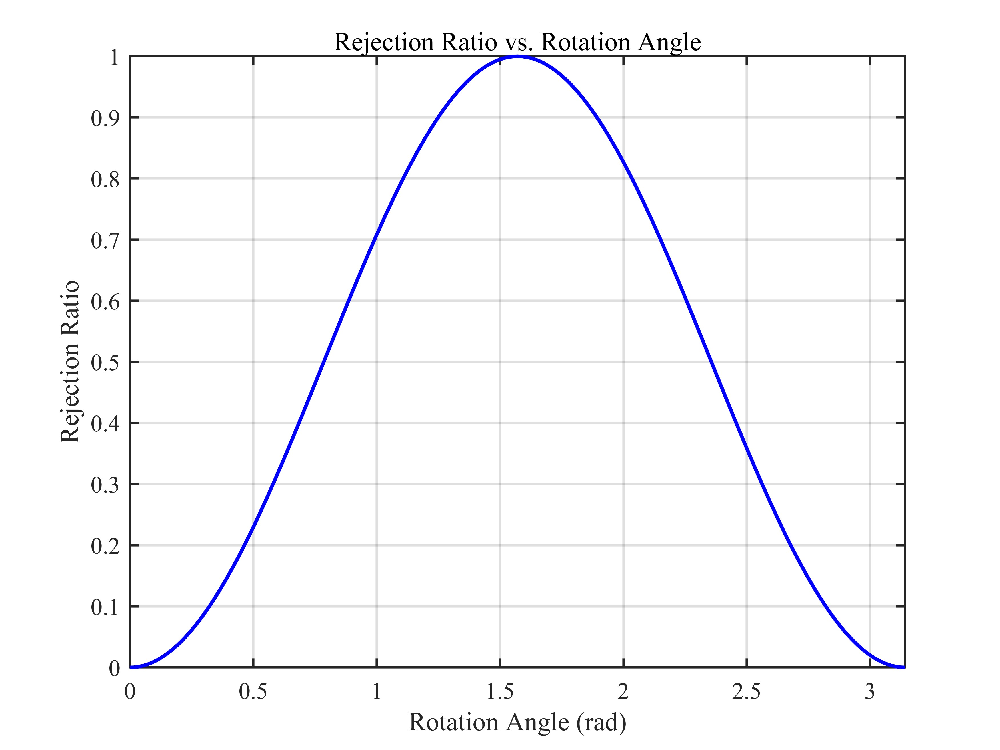

# 单 Sagnac 环透射谱与反射谱仿真 / Single Sagnac Ring Transmission and Reflection Spectra Simulation

## 1. 原理概述 / Principle

Sagnac 环干涉仪由一只 2×2 耦合器的两个输出端口相互连接构成。当在环内插入一段保偏光纤 (PMF) 时，两个反向传播光束的偏振态演化差异产生随波长周期性变化的透射与反射响应，形成梳状滤波特性。该结构广泛应用于微波光子学中的滤波器、传感和波长选择等场景。

A Sagnac ring interferometer is formed by connecting the two output ports of a 2×2 coupler. When a section of polarization-maintaining fiber (PMF) is inserted in the loop, the difference in polarization evolution between the two counter-propagating beams produces a periodic wavelength-dependent transmission and reflection response, forming a comb filter. This structure is widely used in microwave photonics for filtering, sensing, and wavelength selection.

### 核心公式 / Core Equations

**透射谱 / Transmission Spectrum:**

$$
T(\lambda) = (1 - 2k)^2 + 4k(1 - k) \cdot \sin^2\theta \cdot \cos^2\left(\frac{\pi B L}{\lambda}\right)
$$

其中 $k$ 为耦合比，$\theta$ 为偏转角，$B$ 为保偏光纤快慢轴折射率差，$L$ 为保偏光纤长度。

where $k$ is the coupling ratio, $\theta$ is the rotation angle, $B$ is the birefringence (refractive index difference between fast and slow axes), and $L$ is the PMF length.

**反射谱 / Reflection Spectrum:**

$$
R(\lambda) = 4k(1 - k) \cdot \left[1 - \sin^2\theta \cdot \cos^2\left(\frac{\pi B L}{\lambda}\right)\right]
$$

**能量守恒 / Energy Conservation (Lossless Case):**

$$
T(\lambda) + R(\lambda) = 1
$$

**透射谱周期（自由光谱范围）/ Transmission Period (Free Spectral Range):**

$$
\Delta\lambda = \frac{\lambda_0^2}{B \cdot L}
$$

其中 $\lambda_0$ 为中心波长。

where $\lambda_0$ is the center wavelength.

---

## 2. 关键参数 / Key Parameters

| 参数 / Parameter | 符号 / Symbol | 典型值 / Value | 说明 / Description |
|------|------|------|------|
| 耦合比 | $k$ | 0.1 ~ 0.9 | 2×2 耦合器的功率分配比 / Power splitting ratio of the 2×2 coupler |
| 偏转角 | $\theta$ | 0 ~ $\pi$ | 偏振控制器旋转角 / Rotation angle of the polarization controller |
| 快慢轴折射率差 | $B$ | 0.00025 ~ 0.001 | 保偏光纤双折射 / Birefringence of PMF |
| 保偏光纤长度 | $L$ | 0.5 ~ 1.5 m | 环内 PMF 长度 / Length of PMF in the loop |
| 中心波长 | $\lambda_0$ | 1550 nm | 工作波段中心波长 / Center wavelength of the operating band |

---

## 3. 仿真结果 / Simulation Results

> 所有仿真基于单 Sagnac 环模型，默认参数 $k = 0.5$，$B = 0.0005$，$L = 1$ m，$\theta = 90^\circ$。
>
> All simulations are based on the single Sagnac ring model with default parameters $k = 0.5$, $B = 0.0005$, $L = 1$ m, $\theta = 90^\circ$.

### 3.1 透射谱 / Transmission Spectrum

> 默认参数下的 Sagnac 环透射谱

### 3.2 反射谱 / Reflection Spectrum

> 默认参数下的 Sagnac 环反射谱

### 3.3 不同耦合比下的透射谱 / Transmission Spectrum vs. Coupling Ratio

> $L = 1$ m, $B = 0.0005$, $\theta = 90^\circ$, $k = 0.1$ / $0.3$ / $0.5$ / $0.7$ / $0.9$

### 3.4 耦合比与抑制比的关系 / Rejection Ratio vs. Coupling Ratio

> $L = 1$ m, $B = 0.0005$, $\theta = 90^\circ$, $k = 0 : 0.01 : 1$

### 3.5 不同光纤长度下的透射谱 / Transmission Spectrum vs. Fiber Length

> $k = 0.5$, $B = 0.0005$, $\theta = 90^\circ$, $L = 0.5$ / $1.0$ / $1.5$ m

### 3.6 光纤长度与透射谱周期的关系 / Transmission Period vs. Fiber Length

> $\lambda_0 = 1550$ nm, $B = 0.0005$, $L = 0 : 0.01 : 2$ m

### 3.7 不同快慢轴折射率差下的透射谱 / Transmission Spectrum vs. Birefringence

> $k = 0.5$, $L = 1$ m, $\theta = 90^\circ$, $B = 0.00025$ / $0.0005$ / $0.00075$

### 3.8 快慢轴折射率差与透射谱周期的关系 / Transmission Period vs. Birefringence

> $\lambda_0 = 1550$ nm, $L = 1$ m, $B = 0 : 0.00001 : 0.001$

### 3.9 不同偏转角下的透射谱 / Transmission Spectrum vs. Rotation Angle

> $k = 0.5$, $L = 1$ m, $B = 0.0005$, $\theta = 30^\circ$ / $45^\circ$ / $60^\circ$ / $90^\circ$

### 3.10 偏转角与抑制比的关系 / Rejection Ratio vs. Rotation Angle

> $k = 0.5$, $L = 1$ m, $B = 0.0005$, $\theta = 0 : 1^\circ : 180^\circ$

---

*更多算法请返回 [F:\GitHub](../../../README.md).*
