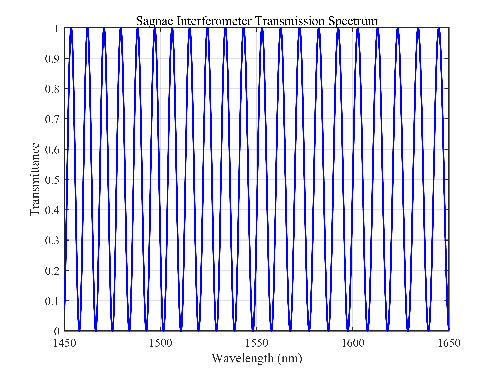
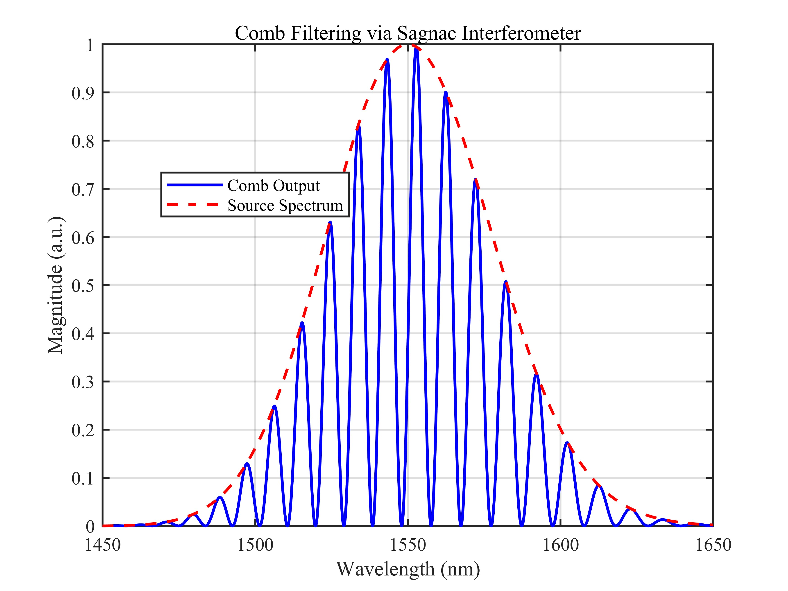
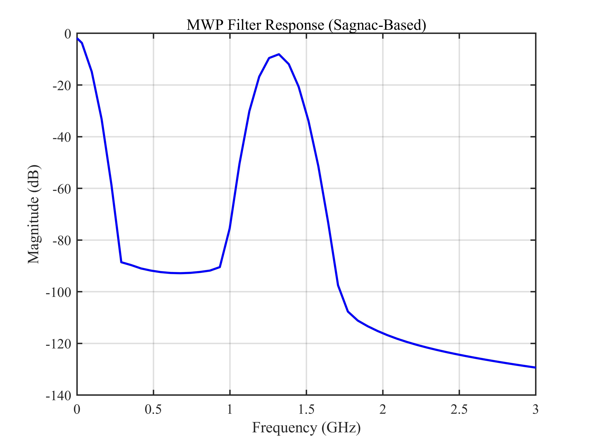
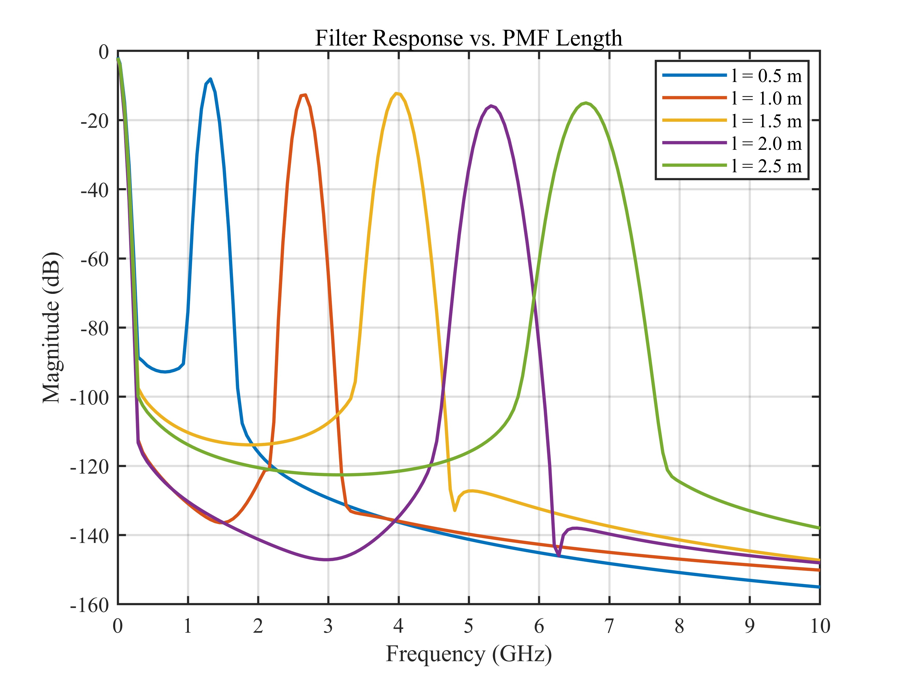
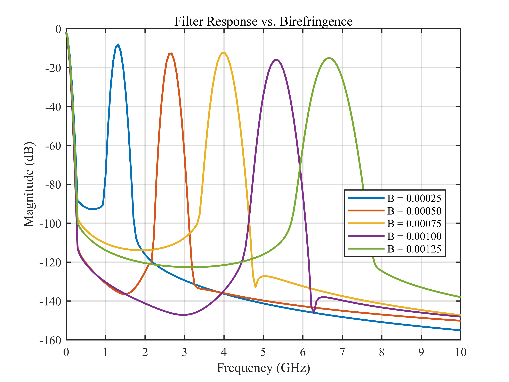
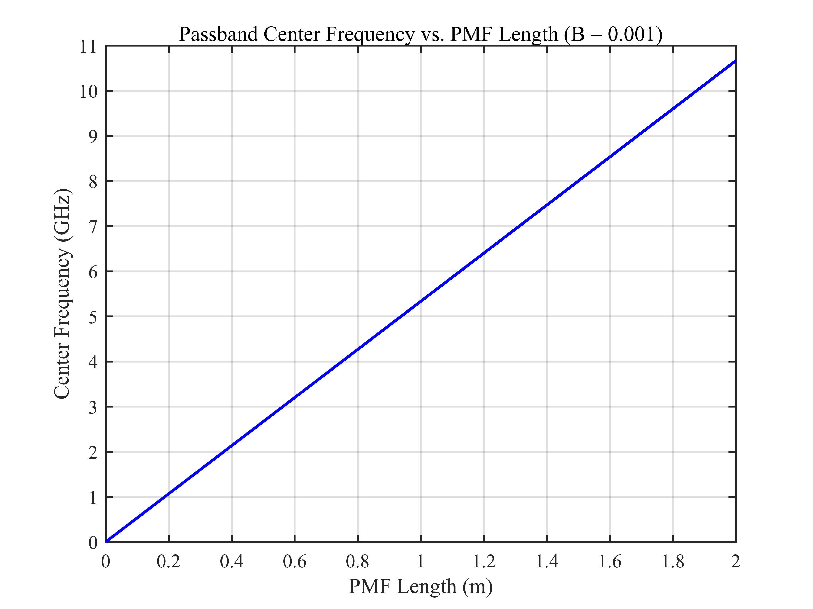
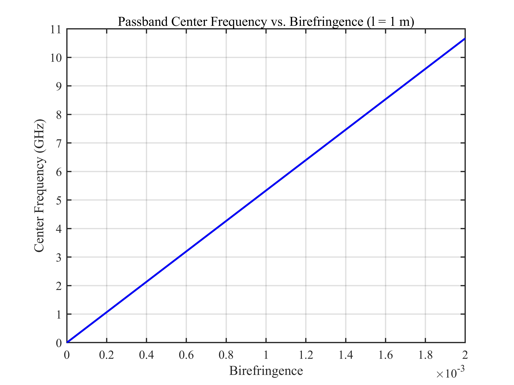

# 基于 Sagnac 干涉仪的微波光子滤波器 / Sagnac Interferometer-Based Microwave Photonic Filter

## 1. 原理概述 / Principle

Sagnac 干涉仪结合保偏光纤 (PMF) 形成梳状滤波器，对宽带光源进行周期性滤波。滤波后的光信号经过色散单模光纤 (SMF) 传输，光学频率梳的周期性在频域映射为微波响应，从而实现微波光子滤波。该结构在微波光子学中可用于可调谐微波滤波、频率选择等场景。

A Sagnac interferometer with polarization-maintaining fiber (PMF) forms a comb filter that periodically filters a broadband source. The filtered optical signal propagates through dispersive single-mode fiber (SMF), and the periodicity of the optical frequency comb maps to a microwave response in the frequency domain, realizing a microwave photonic filter. This structure is applicable in tunable microwave filtering and frequency selection in microwave photonics.

### 核心公式 / Core Equations

**宽带光源光谱（高斯型）/ Broadband Source Spectrum (Gaussian):**

$$
S(\omega) = \frac{P_0}{\sqrt{\pi} \cdot \Delta\omega} \cdot \exp\left[-\left(\frac{\omega - \omega_0}{\Delta\omega}\right)^2\right]
$$

其中 $P_0$ 为光源功率，$\omega_0$ 为中心角频率，$\Delta\omega$ 为光谱带宽。

where $P_0$ is the source power, $\omega_0$ is the center angular frequency, and $\Delta\omega$ is the spectral bandwidth.

**Sagnac 干涉仪透射谱 / Sagnac Interferometer Transmission Spectrum:**

$$
T(\lambda) = (1 - 2k)^2 + 4k(1 - k) \cdot \sin^2\theta \cdot \cos^2\left(\frac{\pi B L}{\lambda}\right)
$$

其中 $k$ 为耦合比，$\theta$ 为偏转角，$B$ 为双折射，$L$ 为保偏光纤长度。

where $k$ is the coupling ratio, $\theta$ is the rotation angle, $B$ is the birefringence, and $L$ is the PMF length.

**梳状滤波输出 / Comb Filtering Output:**

$$
S_T(\omega) = S(\omega) \times T(\omega)
$$

**微波光子滤波器响应 / MWP Filter Response:**

$$
H(\Omega) = 10 \cdot \log_{10}\big|\mathcal{F}\{S_T(\omega)\}\big|
$$

其中频域映射经色散光纤后为 $\Omega = \dfrac{f}{2\pi \beta_2 L}$。

where the frequency-to-time mapping through dispersive fiber gives $\Omega = \dfrac{f}{2\pi \beta_2 L}$.

**通带中心频率 / Passband Center Frequency:**

$$
\Omega_0 = \frac{B \cdot l}{|\beta_2| \cdot L \cdot c}
$$

其中 $\beta_2$ 为 SMF 色散参数，$L$ 为 SMF 长度，$c$ 为真空光速。

where $\beta_2$ is the SMF dispersion parameter, $L$ is the SMF length, and $c$ is the speed of light.

---

## 2. 关键参数 / Key Parameters

| 参数 / Parameter | 符号 / Symbol | 典型值 / Value | 说明 / Description |
|------|------|------|------|
| 耦合比 | $k$ | 0.5 | 2×2 耦合器功率分配比 / Coupler power splitting ratio |
| 偏转角 | $\theta$ | $\pi/2$ | 偏振控制器旋转角 / Polarization controller angle |
| 双折射 | $B$ | 0.00025 ~ 0.00125 | PMF 快慢轴折射率差 / PMF birefringence |
| PMF 长度 | $l$ | 0.5 ~ 2.5 m | 保偏光纤长度 / PMF length |
| SMF 色散 | $\beta_2$ | $-27 \times 10^{-27}$ s²/m | 单模光纤二阶色散 / SMF group-velocity dispersion |
| SMF 长度 | $L$ | 0.5808 km / 25 km | 色散光纤长度 / Dispersive fiber length |

---

## 3. 仿真结果 / Simulation Results

> 所有仿真基于 Sagnac 干涉仪 + 宽带光源 + 色散 SMF 结构。默认参数 $k = 0.5$，$B = 0.0005$，$l = 0.5$ m，$\theta = 90^\circ$。
>
> All simulations use the Sagnac interferometer + broadband source + dispersive SMF configuration. Default parameters: $k = 0.5$, $B = 0.0005$, $l = 0.5$ m, $\theta = 90^\circ$.

### 3.1 宽带光源功率谱 / Broadband Source Power Spectrum

> Gaussian spectrum, $\lambda_0 = 1550$ nm, $\Delta\lambda_{3\text{dB}} \approx 40$ nm

### 3.2 Sagnac 干涉仪透射谱 / Sagnac Interferometer Transmission Spectrum

> $k = 0.5$, $B = 0.0005$, $l = 0.5$ m, $\theta = 90^\circ$

### 3.3 Sagnac 干涉仪梳状滤波 / Comb Filtering via Sagnac Interferometer

> 蓝色实线：梳状滤波输出 (S $\times$ T) | 红色虚线：宽带光源光谱
>
> Blue solid: comb filter output (S $\times$ T) | Red dashed: broadband source spectrum

### 3.4 微波光子滤波器滤波响应 / MWP Filter Response

> $B = 0.0005$, $l = 0.5$ m

### 3.5 不同保偏光纤长度下的滤波响应 / Filter Response vs. PMF Length

> $B = 0.0005$, $l = 0.5$ / $1.0$ / $1.5$ / $2.0$ / $2.5$ m

### 3.6 不同双折射下的滤波响应 / Filter Response vs. Birefringence

> $l = 1$ m, $B = 0.00025$ / $0.0005$ / $0.00075$ / $0.001$ / $0.00125$

### 3.7 保偏光纤长度与通带中心频率的关系 / Passband Center Frequency vs. PMF Length

> $B = 0.001$, $\beta_2 L = 25 \times 10^{-27} \times 25 \times 10^3$ s²/m

### 3.8 双折射与通带中心频率的关系 / Passband Center Frequency vs. Birefringence

> $l = 1$ m, $\beta_2 L = 25 \times 10^{-27} \times 25 \times 10^3$ s²/m

---

*更多算法请返回 [F:\GitHub](../../../README.md).*
