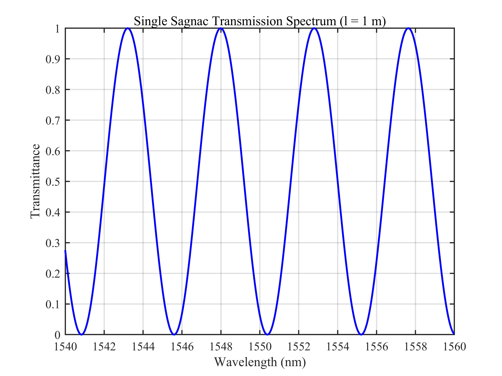
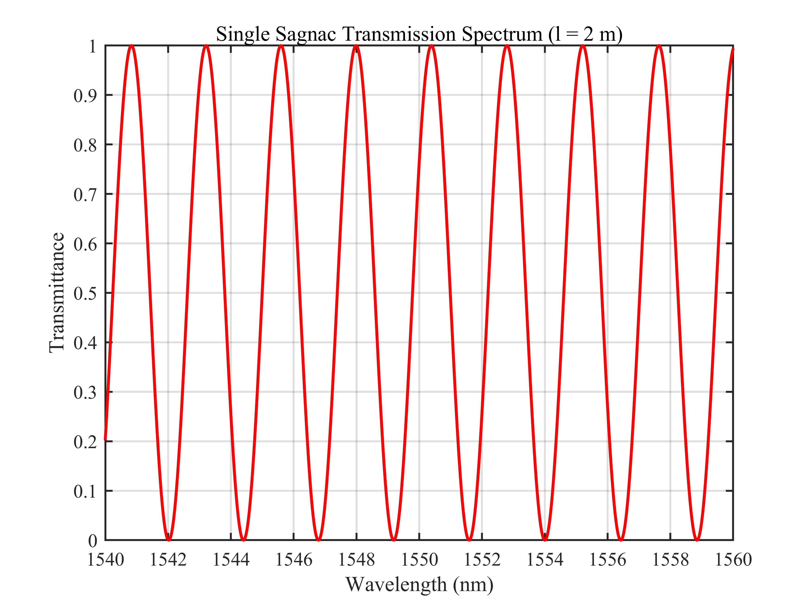
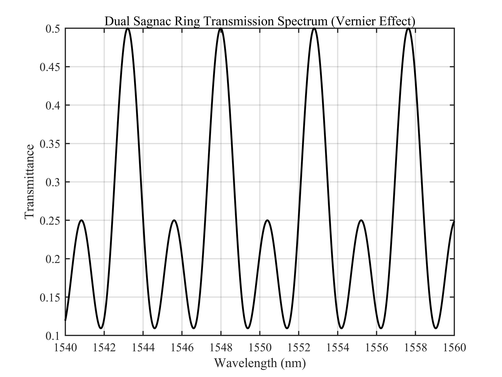
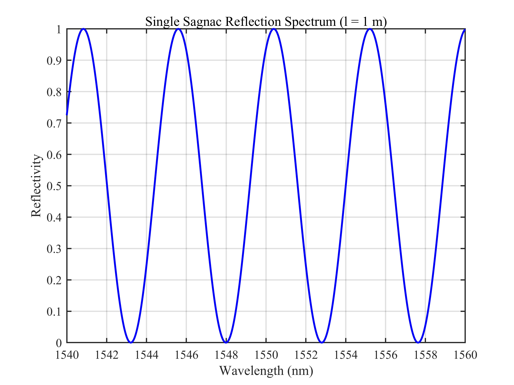
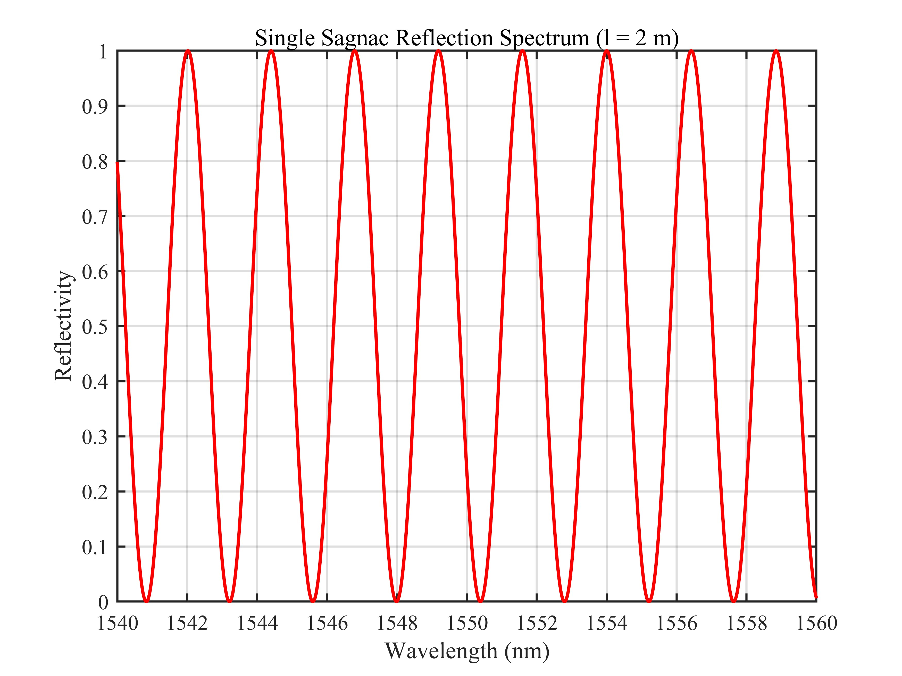
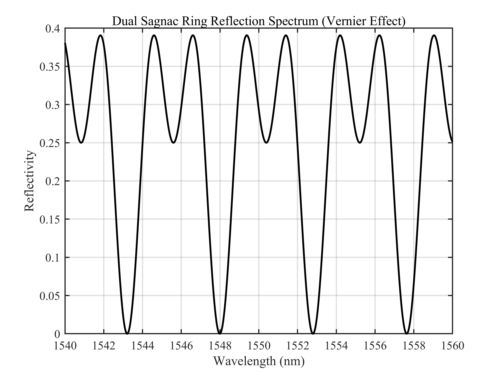

# 双 Sagnac 环透射谱与反射谱仿真 / Dual Sagnac Ring Transmission and Reflection Spectra Simulation

## 1. 原理概述 / Principle

双 Sagnac 环结构由两个并联的 Sagnac 干涉仪构成，分别包含不同长度的保偏光纤（PMF）。两个 Sagnac 环具有不同的自由光谱范围（FSR），通过加权叠加形成 Vernier 效应：当两个环的透射峰对齐时输出增强，错位时输出被抑制，从而产生周期性包络调制。该结构可提高梳状滤波器的光谱选择性和精细度。

A dual Sagnac ring structure consists of two parallel Sagnac interferometers with different PMF lengths. The two Sagnac rings have different free spectral ranges (FSR). Their weighted superposition produces a Vernier effect: when the transmission peaks of both rings align, the output is enhanced; when they misalign, the output is suppressed, resulting in a periodic envelope modulation. This structure improves the spectral selectivity and finesse of the comb filter.

### 核心公式 / Core Equations

**单 Sagnac 环透射谱 / Single Sagnac Ring Transmission Spectrum:**

$$
T_i(\lambda) = (1 - 2k_i)^2 + 4k_i(1 - k_i) \cdot \sin^2\theta_i \cdot \cos^2\left(\frac{\pi B_i L_i}{\lambda}\right), \quad i = 1, 2
$$

**单 Sagnac 环反射谱 / Single Sagnac Ring Reflection Spectrum:**

$$
R_i(\lambda) = 4k_i(1 - k_i) \cdot \left[1 - \sin^2\theta_i \cdot \cos^2\left(\frac{\pi B_i L_i}{\lambda}\right)\right], \quad i = 1, 2
$$

其中 $k_i$ 为耦合比，$\theta_i$ 为偏转角，$B_i$ 为双折射，$L_i$ 为 PMF 长度。

where $k_i$ is the coupling ratio, $\theta_i$ is the rotation angle, $B_i$ is the birefringence, and $L_i$ is the PMF length.

**能量守恒（无损）/ Energy Conservation (Lossless):**

$$
T_i(\lambda) + R_i(\lambda) = 1
$$

**双 Sagnac 环并联输出 / Dual Sagnac Ring Combined Output:**

$$
T(\lambda) = 0.25 \cdot T_1(\lambda) + 0.25 \cdot T_2(\lambda)
$$

$$
R(\lambda) = 0.25 \cdot R_1(\lambda) + 0.25 \cdot R_2(\lambda)
$$

其中 0.25 因子源于 3 dB 耦合器的功率分配（每路贡献 1/4）。

The factor 0.25 arises from power splitting by the 3 dB couplers (each branch contributes 1/4).

**透射谱周期（自由光谱范围）/ Transmission Period (Free Spectral Range):**

$$
\Delta\lambda_i = \frac{\lambda_0^2}{B_i \cdot L_i}
$$

**Vernier 包络周期 / Vernier Envelope Period:**

$$
\Delta\lambda_{\text{env}} = \frac{\Delta\lambda_1 \cdot \Delta\lambda_2}{|\Delta\lambda_1 - \Delta\lambda_2|}
$$

---

## 2. 关键参数 / Key Parameters

| 参数 / Parameter | 符号 / Symbol | 环 1 / Ring 1 | 环 2 / Ring 2 | 说明 / Description |
|------|------|------|------|------|
| 耦合比 | $k$ | 0.5 | 0.5 | 2×2 耦合器功率分配比 / Coupler splitting ratio |
| 偏转角 | $\theta$ | $\pi/2$ | $\pi/2$ | 偏振控制器旋转角 / Polarization controller angle |
| 双折射 | $B$ | 0.0005 | 0.0005 | PMF 快慢轴折射率差 / PMF birefringence |
| PMF 长度 | $L$ | 1 m | 2 m | 保偏光纤长度 / PMF length |

---

## 3. 仿真结果 / Simulation Results

> 所有仿真基于并联双 Sagnac 环模型，默认参数 $k = 0.5$，$B = 0.0005$，$\theta = 90^\circ$。
>
> All simulations are based on the dual Sagnac ring model with default parameters $k = 0.5$, $B = 0.0005$, $\theta = 90^\circ$.

### 3.1 单环（l = 1 m）透射谱 / Single Sagnac Transmission (l = 1 m)

> $k = 0.5$, $B = 0.0005$, $\theta = 90^\circ$, $L = 1$ m

### 3.2 单环（l = 2 m）透射谱 / Single Sagnac Transmission (l = 2 m)

> $k = 0.5$, $B = 0.0005$, $\theta = 90^\circ$, $L = 2$ m

### 3.3 双环并联透射谱 / Dual Sagnac Transmission (Vernier Effect)

> $L_1 = 1$ m, $L_2 = 2$ m, 0.25 scaling each

### 3.4 单环（l = 1 m）反射谱 / Single Sagnac Reflection (l = 1 m)

> $k = 0.5$, $B = 0.0005$, $\theta = 90^\circ$, $L = 1$ m

### 3.5 单环（l = 2 m）反射谱 / Single Sagnac Reflection (l = 2 m)

> $k = 0.5$, $B = 0.0005$, $\theta = 90^\circ$, $L = 2$ m

### 3.6 双环并联反射谱 / Dual Sagnac Reflection (Vernier Effect)

> $L_1 = 1$ m, $L_2 = 2$ m, 0.25 scaling each

---

*更多算法请返回 [F:\GitHub](../../../README.md).*
