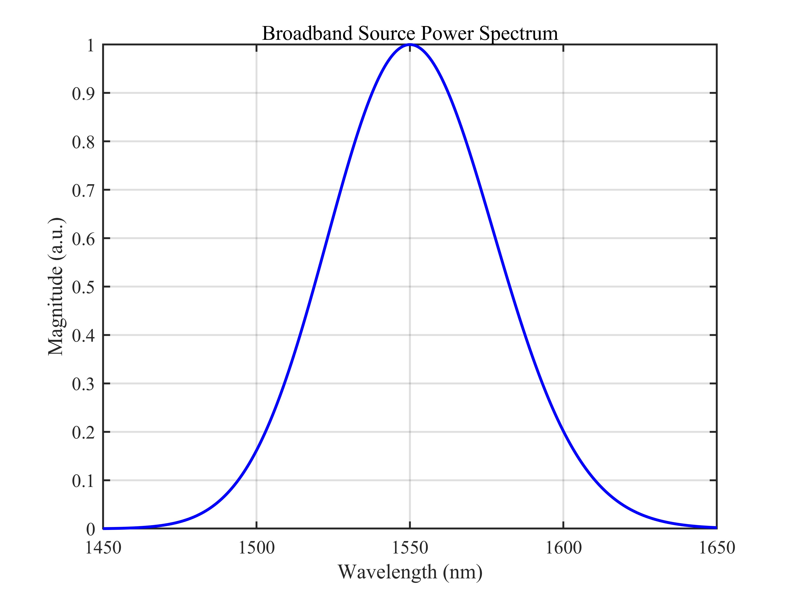
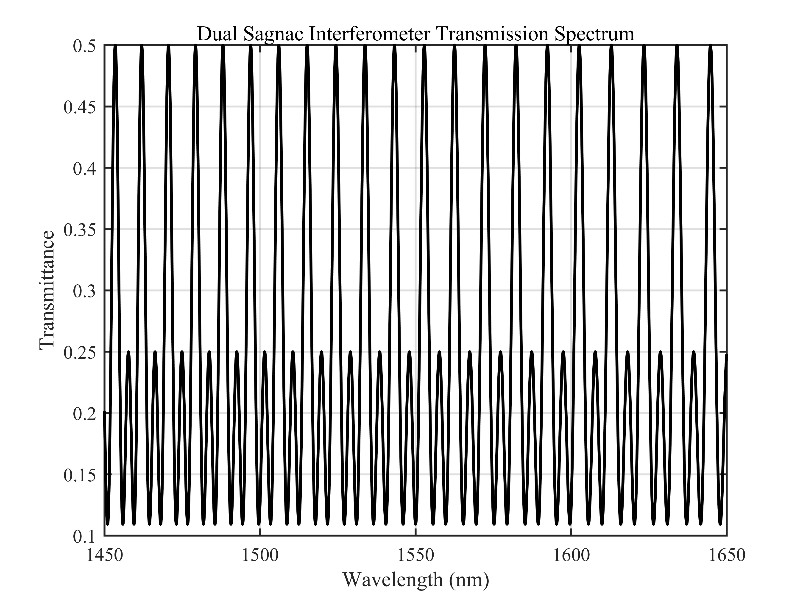
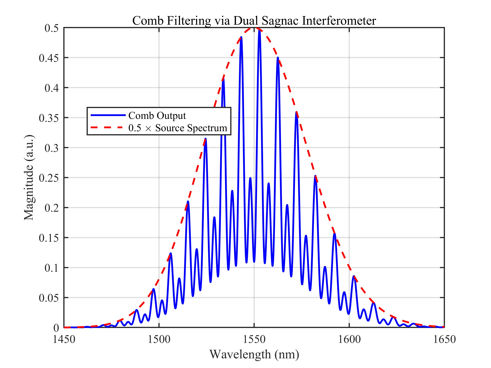
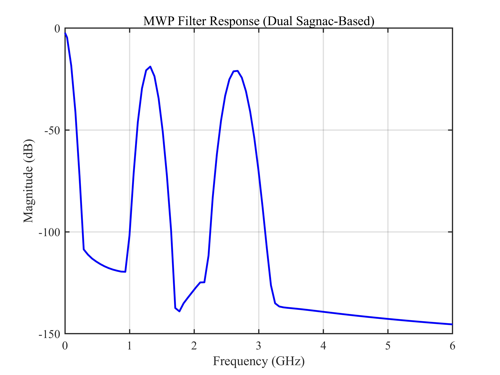

# 双 Sagnac 环微波光子滤波器 / Dual Sagnac Ring Microwave Photonic Filter

## 1. 原理概述 / Principle

双 Sagnac 环微波光子滤波器结合了并联双 Sagnac 干涉仪的 Vernier 效应与色散光纤的频时映射。两个并联的 Sagnac 干涉仪分别包含不同长度的保偏光纤（PMF），其透射谱具有不同的自由光谱范围（FSR）。通过加权叠加，Vernier 效应产生周期性包络调制，增强了光谱选择性。经梳状滤波后的光信号通过色散单模光纤（SMF）传输，光学频率梳的周期性映射为微波响应信号。

The dual Sagnac ring microwave photonic filter combines the Vernier effect of parallel dual Sagnac interferometers with the frequency-to-time mapping in dispersive fiber. Two parallel Sagnac interferometers with different PMF lengths produce transmission spectra with distinct FSRs. Through weighted superposition, the Vernier effect generates a periodic envelope modulation, enhancing spectral selectivity. The comb-filtered optical signal passes through dispersive single-mode fiber (SMF), mapping the optical frequency comb periodicity to a microwave response.

### 核心公式 / Core Equations

**宽带光源光谱（高斯型）/ Broadband Source Spectrum (Gaussian):**

$$
S(\omega) = \frac{P_0}{\sqrt{\pi} \cdot \Delta\omega} \cdot \exp\left[-\left(\frac{\omega - \omega_0}{\Delta\omega}\right)^2\right]
$$

**单 Sagnac 环透射谱 / Single Sagnac Ring Transmission Spectrum:**

$$
T_i(\lambda) = (1 - 2k_i)^2 + 4k_i(1 - k_i) \cdot \sin^2\theta_i \cdot \cos^2\left(\frac{\pi B_i L_i}{\lambda}\right), \quad i = 1, 2
$$

**双 Sagnac 环并联透射谱 / Dual Sagnac Combined Transmission:**

$$
T(\lambda) = 0.25 \cdot T_1(\lambda) + 0.25 \cdot T_2(\lambda)
$$

**梳状滤波输出 / Comb Filtering Output:**

$$
S_T(\omega) = S(\omega) \times T(\omega)
$$

**微波光子滤波器响应 / MWP Filter Response:**

$$
H(\Omega) = 10 \cdot \log_{10}\big|\mathcal{F}\{S(\omega) \cdot T(\omega)\}\big|
$$

其中频域映射为 $\Omega = \dfrac{f}{2\pi \beta_2 L}$。

where the frequency mapping is $\Omega = \dfrac{f}{2\pi \beta_2 L}$.

---

## 2. 关键参数 / Key Parameters

| 参数 / Parameter | 符号 / Symbol | 环 1 / Ring 1 | 环 2 / Ring 2 | 说明 / Description |
|------|------|------|------|------|
| 耦合比 | $k$ | 0.5 | 0.5 | 2×2 耦合器功率分配比 / Coupler splitting ratio |
| 偏转角 | $\theta$ | $\pi/2$ | $\pi/2$ | 偏振控制器旋转角 / Polarization controller angle |
| 双折射 | $B$ | 0.0005 | 0.0005 | PMF 快慢轴折射率差 / PMF birefringence |
| PMF 长度 | $L$ | 0.5 m | 1 m | 保偏光纤长度 / PMF length |
| SMF 色散 | $\beta_2$ | - | $-27 \times 10^{-27}$ s²/m | 单模光纤二阶色散 / SMF GVD parameter |
| SMF 长度 | $L$ | - | 580.8 m | 色散光纤长度 / Dispersive fiber length |

---

## 3. 仿真结果 / Simulation Results

> 所有仿真基于双 Sagnac 环 + 宽带光源 + 色散 SMF 结构。默认参数 $k_1 = k_2 = 0.5$，$B_1 = B_2 = 0.0005$，$l_1 = 0.5$ m，$l_2 = 1$ m。
>
> All simulations use the dual Sagnac + broadband source + dispersive SMF configuration. Default parameters: $k_1 = k_2 = 0.5$, $B_1 = B_2 = 0.0005$, $l_1 = 0.5$ m, $l_2 = 1$ m.

### 3.1 宽带光源功率谱 / Broadband Source Power Spectrum

> Gaussian spectrum, $\lambda_0 = 1550$ nm, $\Delta\lambda_{3\text{dB}} \approx 40$ nm

### 3.2 双 Sagnac 干涉仪透射谱 / Dual Sagnac Interferometer Transmission Spectrum

> Vernier 效应产生包络调制，$l_1 = 0.5$ m, $l_2 = 1$ m

### 3.3 双 Sagnac 干涉仪梳状滤波 / Comb Filtering via Dual Sagnac Interferometer

> 蓝色实线：梳状滤波输出 (S $\times$ T) | 红色虚线：0.5 $\times$ 光源光谱
>
> Blue solid: comb filter output (S $\times$ T) | Red dashed: 0.5 $\times$ source spectrum

### 3.4 微波光子滤波器滤波响应 / MWP Filter Response

> $l_1 = 0.5$ m, $l_2 = 1$ m

---

*更多算法请返回 [F:\GitHub](../../../README.md).*
