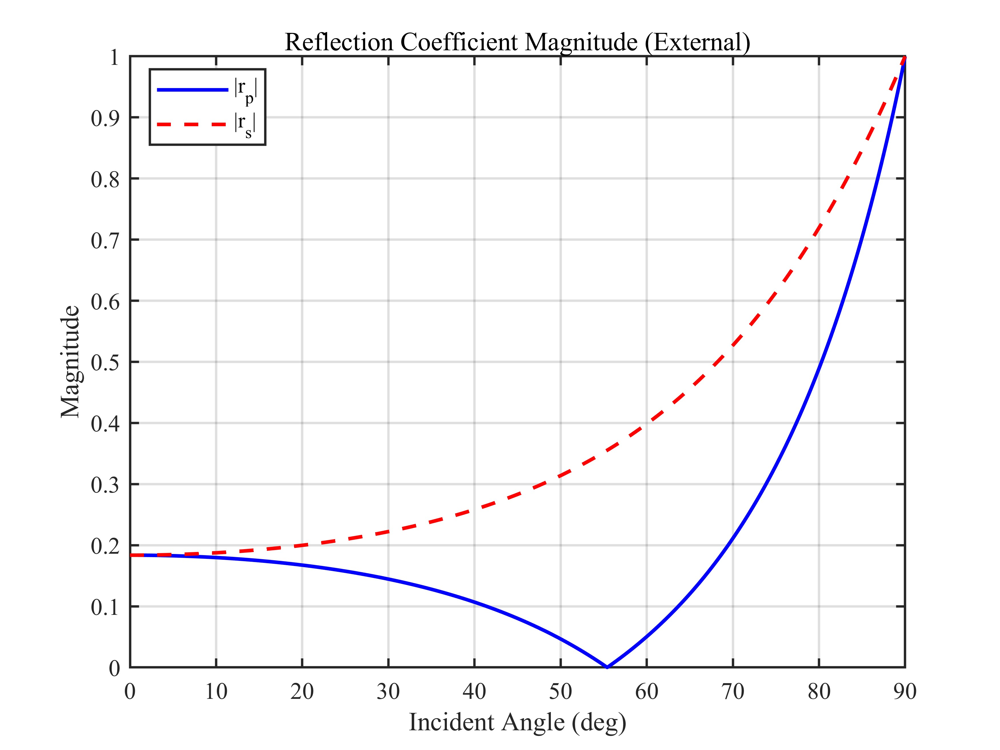
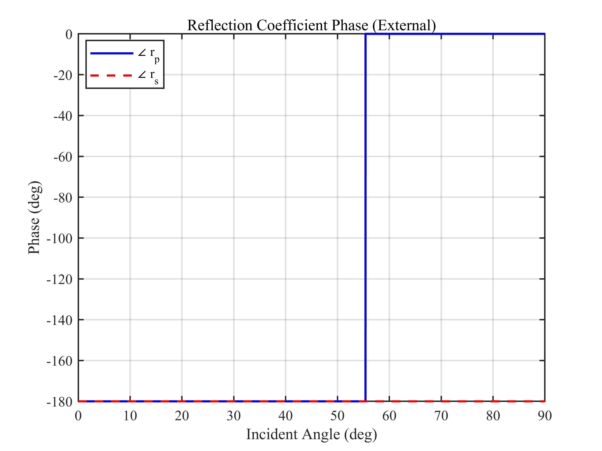
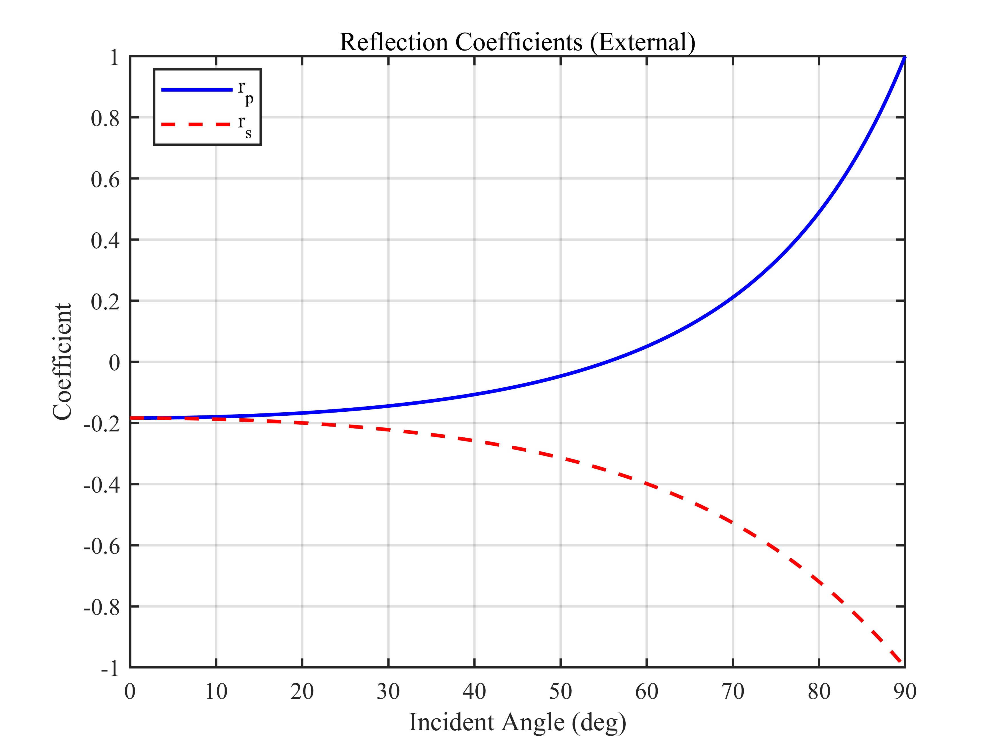
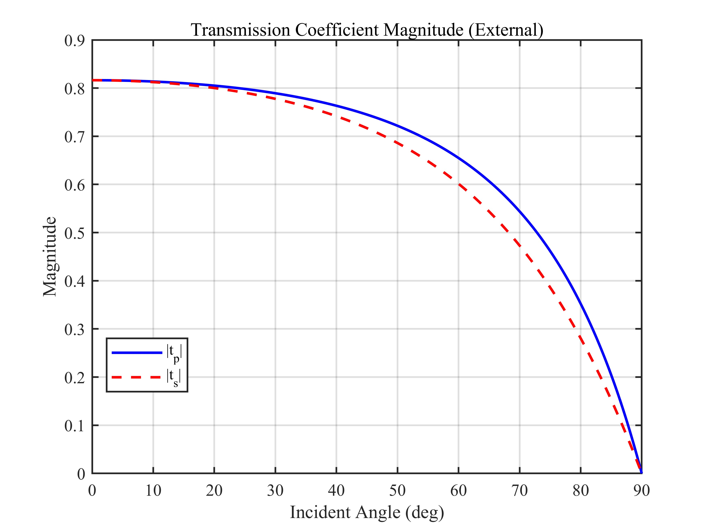
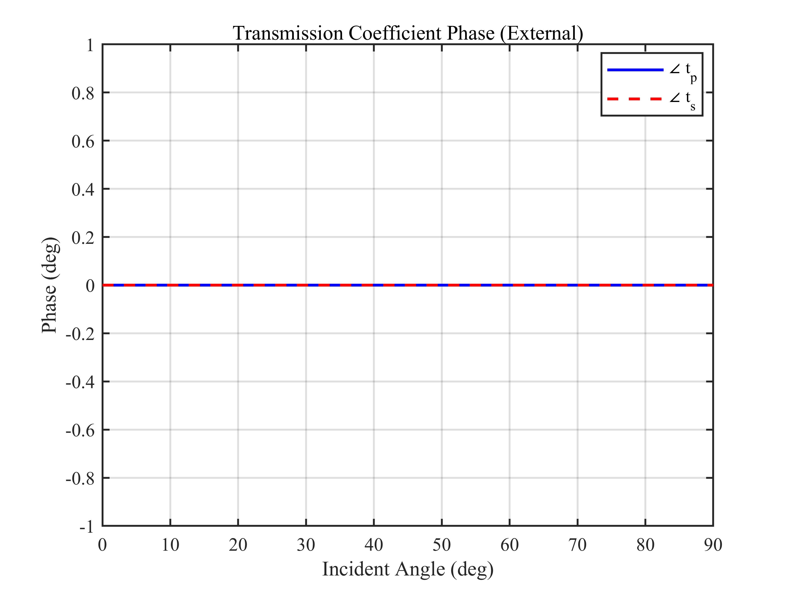
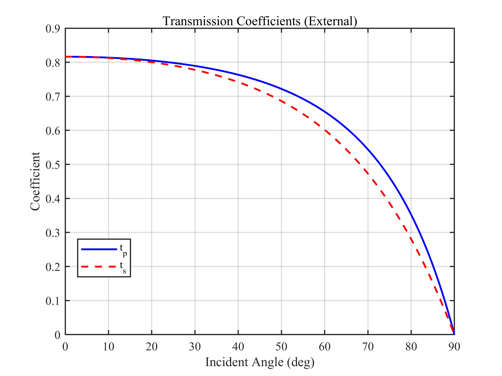

# 外反射 Fresnel 公式仿真 / External Fresnel Reflection Simulation

## 1. 原理概述 / Principle

菲涅尔公式描述了平面光波在两种均匀介质界面上的反射与透射行为。外反射指光从光疏介质入射到光密介质（$n_1 < n_2$）的情形，本仿真以空气（$n_1 = 1.00$）到玻璃（$n_2 = 1.45$）界面为例。根据偏振方向不同，分为 s 偏振（TE，电场垂直于入射面）和 p 偏振（TM，电场平行于入射面）两种情况。当入射角等于布儒斯特角时，$r_p = 0$，反射光为纯 s 偏振。

The Fresnel equations describe the reflection and transmission of plane waves at the interface between two homogeneous media. External reflection refers to light propagating from a lower-index to a higher-index medium ($n_1 < n_2$). This simulation uses the air ($n_1 = 1.00$) to glass ($n_2 = 1.45$) interface as an example. Based on polarization, two cases are considered: s-polarization (TE, electric field perpendicular to the plane of incidence) and p-polarization (TM, electric field parallel to the plane of incidence). At the Brewster angle, $r_p = 0$ and the reflected light becomes purely s-polarized.

### 核心公式 / Core Equations

**s 偏振反射系数 / s-Polarization Reflection Coefficient:**

$$
r_s = \frac{n_1\cos\theta_1 - n_2\cos\theta_2}{n_1\cos\theta_1 + n_2\cos\theta_2}
$$

**s 偏振透射系数 / s-Polarization Transmission Coefficient:**

$$
t_s = \frac{2n_1\cos\theta_1}{n_1\cos\theta_1 + n_2\cos\theta_2}
$$

**p 偏振反射系数 / p-Polarization Reflection Coefficient:**

$$
r_p = \frac{n_2\cos\theta_1 - n_1\cos\theta_2}{n_2\cos\theta_1 + n_1\cos\theta_2}
$$

**p 偏振透射系数 / p-Polarization Transmission Coefficient:**

$$
t_p = \frac{2n_1\cos\theta_1}{n_2\cos\theta_1 + n_1\cos\theta_2}
$$

其中 $\theta_1$ 为入射角，$\theta_2$ 由 Snell 定律 $n_1\sin\theta_1 = n_2\sin\theta_2$ 确定。

where $\theta_1$ is the incident angle and $\theta_2$ is given by Snell's law $n_1\sin\theta_1 = n_2\sin\theta_2$.

**布儒斯特角 / Brewster Angle:**

$$
\theta_B = \arctan\left(\frac{n_2}{n_1}\right) \approx 55.4^\circ
$$

---

## 2. 关键参数 / Key Parameters

| 参数 / Parameter | 符号 / Symbol | 值 / Value | 说明 / Description |
|------|------|------|------|
| 入射介质折射率 | $n_1$ | 1.00 | 空气 / Air |
| 透射介质折射率 | $n_2$ | 1.45 | 玻璃 / Glass |
| 相对折射率 | $n = n_2/n_1$ | 1.45 | 相对折射率 / Relative refractive index |
| 扫描角度范围 | $\theta_1$ | $0^\circ \sim 90^\circ$ | 入射角扫描 / Incident angle sweep |

---

## 3. 仿真结果 / Simulation Results

> $n_1 = 1.00$（空气），$n_2 = 1.45$（玻璃），$\theta_B \approx 55.4^\circ$

### 3.1 反射系数幅度 / Reflection Coefficient Magnitude

> 蓝色实线：$|r_p|$，红色虚线：$|r_s|$。布儒斯特角处 $r_p = 0$

### 3.2 反射系数相位 / Reflection Coefficient Phase

> p 偏振在布儒斯特角处相位跃变 $180^\circ$

### 3.3 反射系数 / Reflection Coefficients

> $r_s$ 始终为负，$r_p$ 在布儒斯特角处过零变号

### 3.4 透射系数幅度 / Transmission Coefficient Magnitude

### 3.5 透射系数相位 / Transmission Coefficient Phase

### 3.6 透射系数 / Transmission Coefficients

---

*更多算法请返回 [F:\GitHub](../../README.md).*
