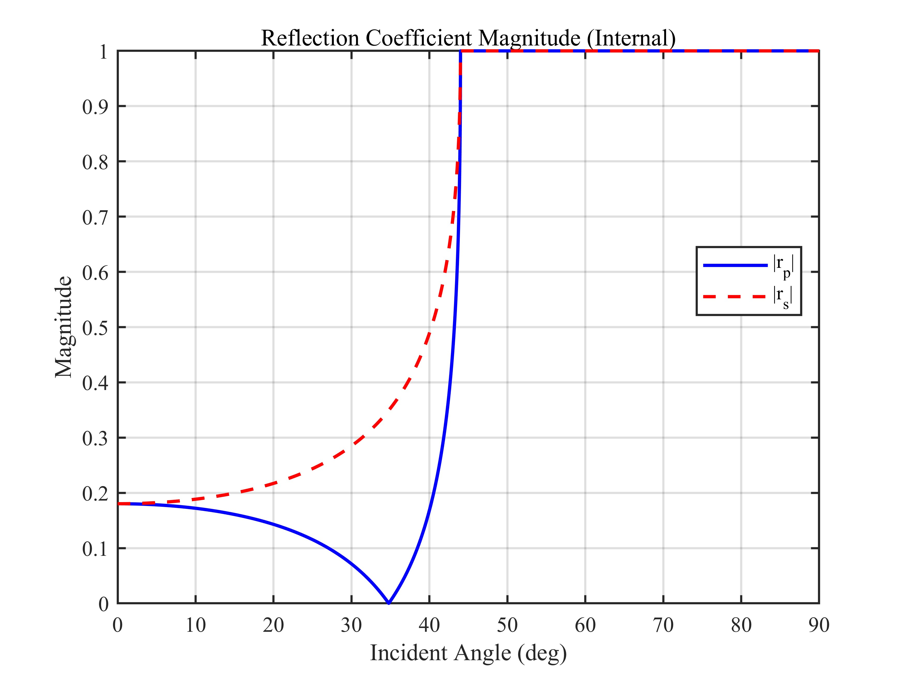
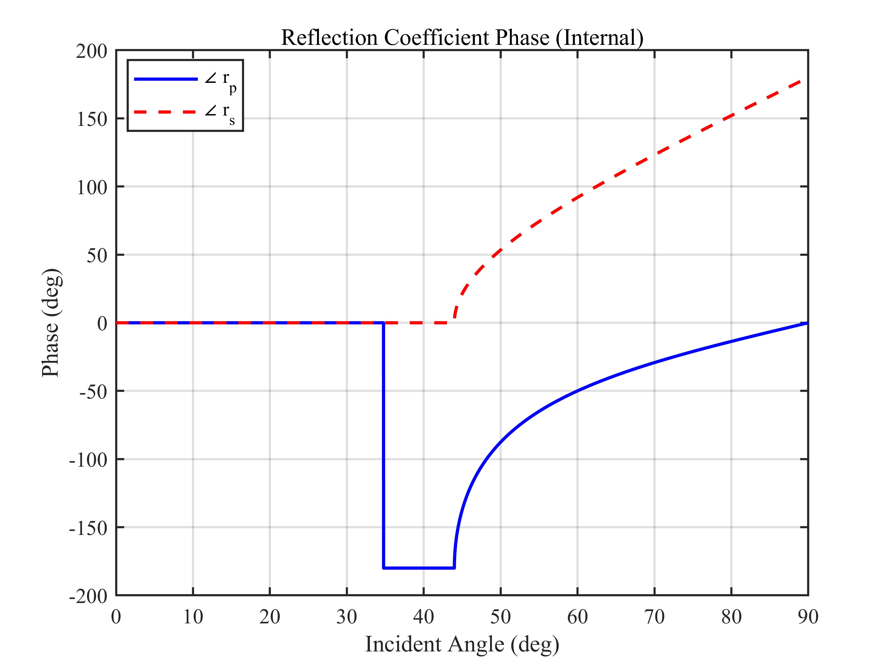
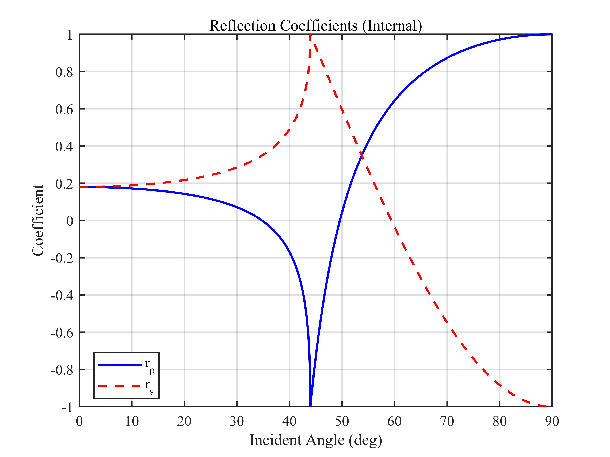
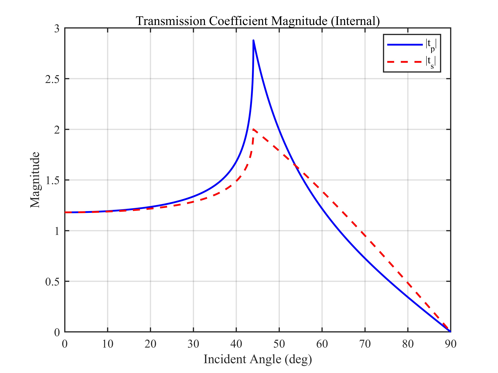
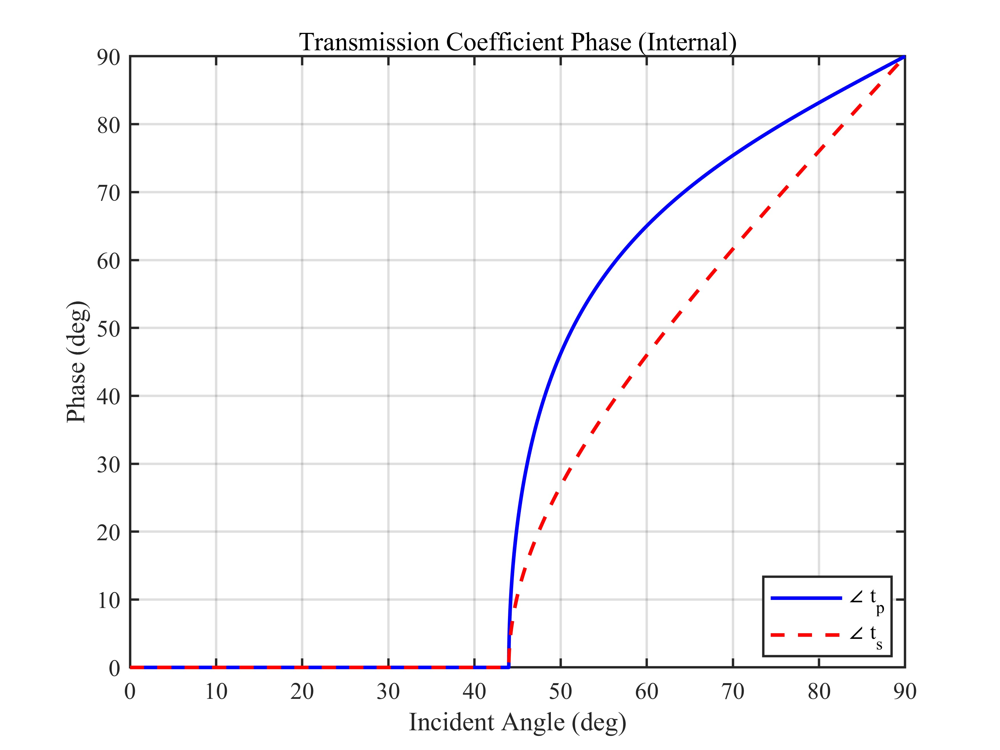
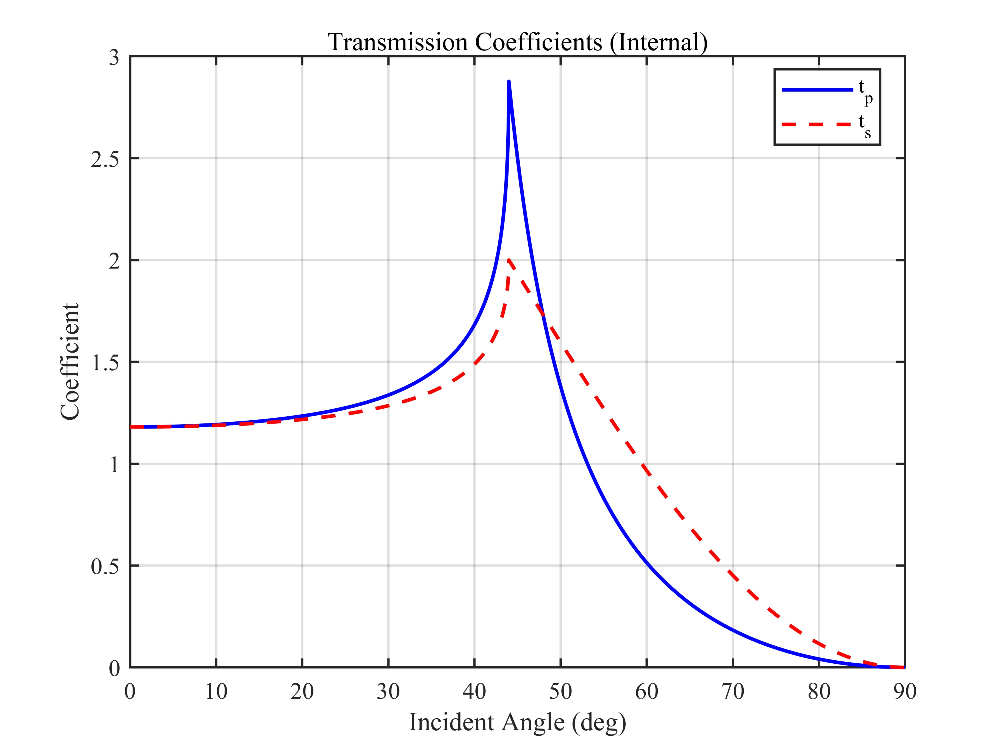

# 内反射 Fresnel 公式仿真 / Internal Fresnel Reflection Simulation

## 1. 原理概述 / Principle

菲涅尔公式描述了平面光波在两种均匀介质界面上的反射与透射行为。内反射指光从光密介质入射到光疏介质（$n_1 > n_2$）的情形，本仿真以玻璃（$n_1 = 1.44$）到空气（$n_2 = 1.00$）界面为例。当入射角超过临界角 $\theta_c$ 时发生全内反射（Total Internal Reflection, TIR），反射系数变为复数且 $|r| = 1$，产生与偏振相关的相位跃变（Goos-Hänchen 相移）。

The Fresnel equations describe the reflection and transmission of plane waves at the interface between two homogeneous media. Internal reflection refers to light propagating from a higher-index to a lower-index medium ($n_1 > n_2$). This simulation uses the glass ($n_1 = 1.44$) to air ($n_2 = 1.00$) interface as an example. When the incident angle exceeds the critical angle $\theta_c$, total internal reflection (TIR) occurs: the reflection coefficients become complex with $|r| = 1$, producing polarization-dependent phase shifts (Goos-H\"anchen shift).

### 核心公式 / Core Equations

**s 偏振反射系数 / s-Polarization Reflection Coefficient:**

$$
r_s = \frac{n_1\cos\theta_1 - n_2\cos\theta_2}{n_1\cos\theta_1 + n_2\cos\theta_2}
$$

**s 偏振透射系数 / s-Polarization Transmission Coefficient:**

$$
t_s = \frac{2n_1\cos\theta_1}{n_1\cos\theta_1 + n_2\cos\theta_2}
$$

**p 偏振反射系数 / p-Polarization Reflection Coefficient:**

$$
r_p = \frac{n_2\cos\theta_1 - n_1\cos\theta_2}{n_2\cos\theta_1 + n_1\cos\theta_2}
$$

**p 偏振透射系数 / p-Polarization Transmission Coefficient:**

$$
t_p = \frac{2n_1\cos\theta_1}{n_2\cos\theta_1 + n_1\cos\theta_2}
$$

其中 $\theta_1$ 为入射角，$\theta_2$ 由 Snell 定律 $n_1\sin\theta_1 = n_2\sin\theta_2$ 确定。

where $\theta_1$ is the incident angle and $\theta_2$ is given by Snell's law $n_1\sin\theta_1 = n_2\sin\theta_2$.

**临界角 / Critical Angle:**

$$
\theta_c = \arcsin\left(\frac{n_2}{n_1}\right) \approx 44.0^\circ
$$

当 $\theta_1 > \theta_c$ 时，$n^2 - \sin^2\theta_1 < 0$，$\sqrt{n^2 - \sin^2\theta_1}$ 为虚数，反射系数为复数，$|r_s| = |r_p| = 1$。

When $\theta_1 > \theta_c$, $n^2 - \sin^2\theta_1 < 0$, $\sqrt{n^2 - \sin^2\theta_1}$ becomes imaginary, the reflection coefficients become complex, and $|r_s| = |r_p| = 1$.

---

## 2. 关键参数 / Key Parameters

| 参数 / Parameter | 符号 / Symbol | 值 / Value | 说明 / Description |
|------|------|------|------|
| 入射介质折射率 | $n_1$ | 1.44 | 玻璃 / Glass |
| 透射介质折射率 | $n_2$ | 1.00 | 空气 / Air |
| 相对折射率 | $n = n_2/n_1$ | 0.694 | 相对折射率 / Relative refractive index |
| 临界角 | $\theta_c$ | $44.0^\circ$ | 全内反射临界角 / TIR critical angle |
| 扫描角度范围 | $\theta_1$ | $0^\circ \sim 90^\circ$ | 入射角扫描 / Incident angle sweep |

---

## 3. 仿真结果 / Simulation Results

> $n_1 = 1.44$（玻璃），$n_2 = 1.00$（空气），$\theta_c \approx 44.0^\circ$，包含 TIR 区域

### 3.1 反射系数幅度 / Reflection Coefficient Magnitude

> $\theta > \theta_c$ 时 $|r| = 1$（全内反射）

### 3.2 反射系数相位 / Reflection Coefficient Phase

> TIR 区域内产生连续相位跃变，p 偏振相位变化大于 s 偏振

### 3.3 反射系数 / Reflection Coefficients

> $\theta > \theta_c$ 后反射系数为复数

### 3.4 透射系数幅度 / Transmission Coefficient Magnitude

> $\theta > \theta_c$ 时倏逝波振幅呈指数衰减

### 3.5 透射系数相位 / Transmission Coefficient Phase

### 3.6 透射系数 / Transmission Coefficients

---

*更多算法请返回 [F:\GitHub](../../README.md).*
