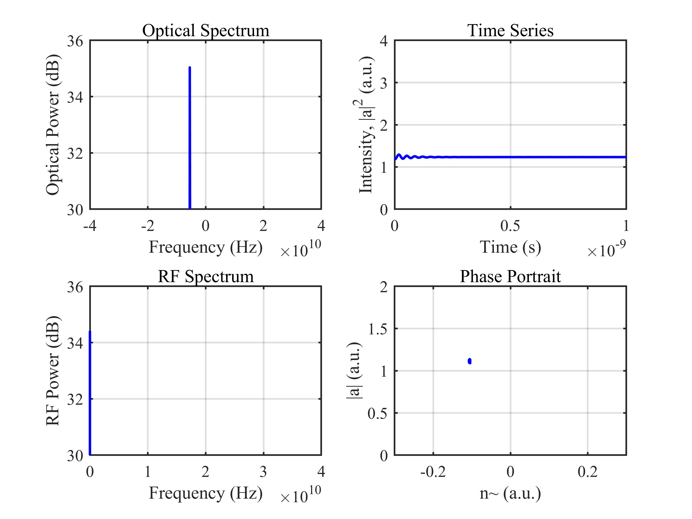
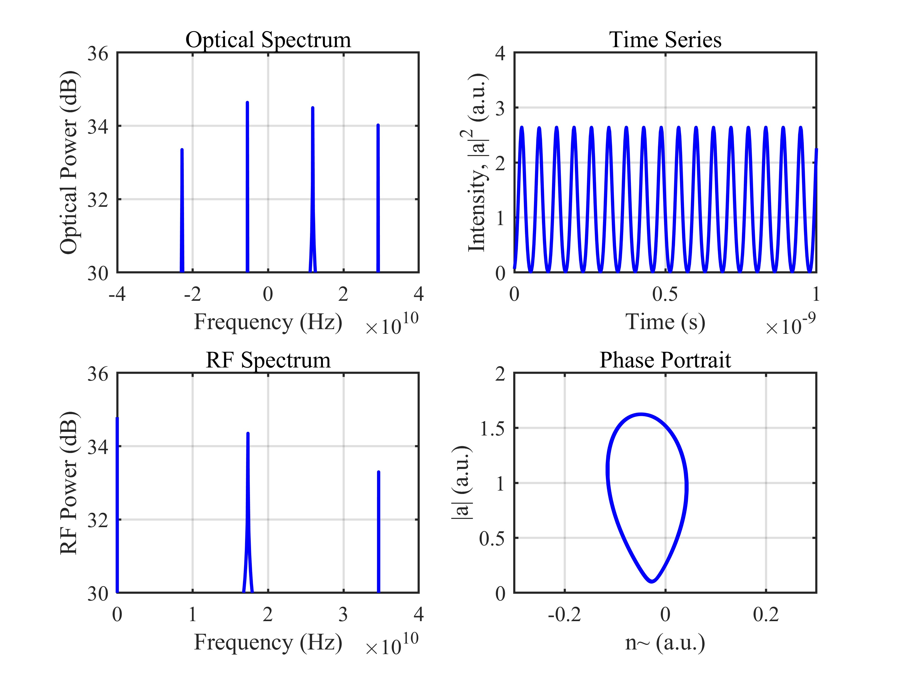
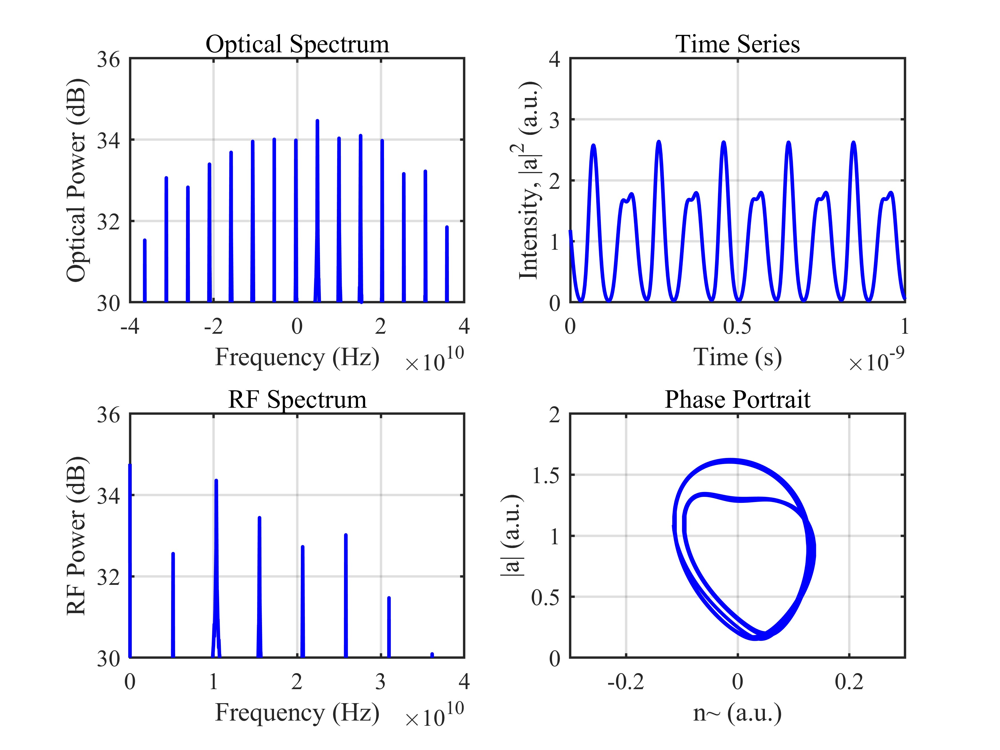
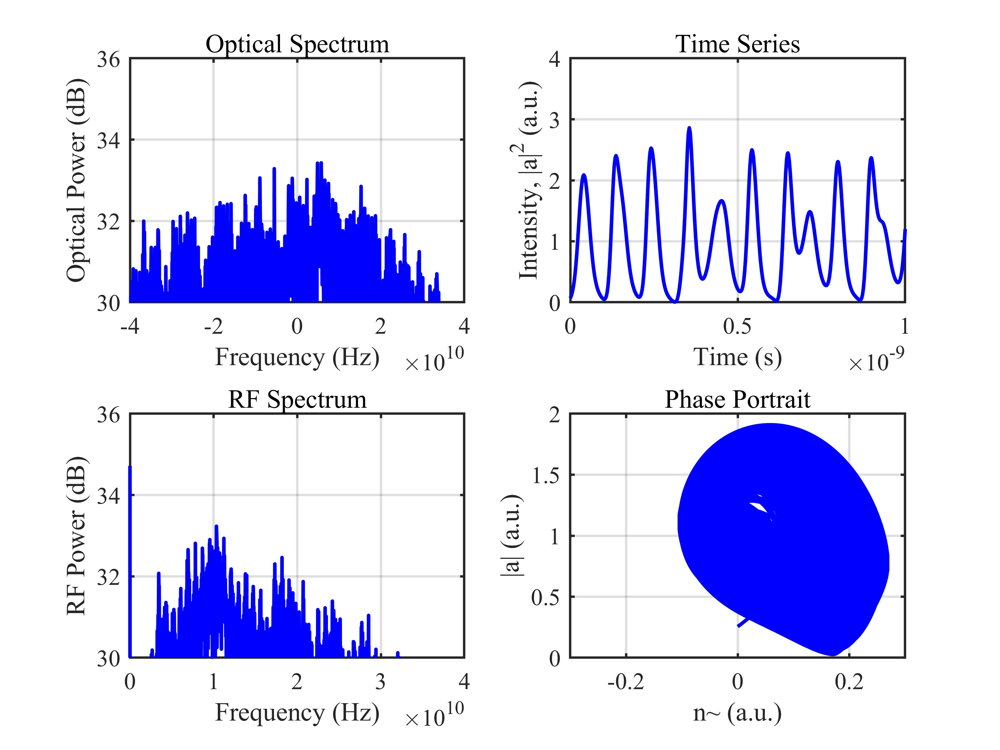

# 基于光注入半导体激光器的微波信号产生 / Microwave Signal Generation via Optically Injected Semiconductor Laser

## 1. 原理概述 / Principle

光注入半导体激光器是产生微波信号的有效方法之一。通过向从激光器注入主激光器的光信号，可以改变从激光器的动力学行为，产生稳态锁定、单周期振荡、倍周期振荡和混沌振荡等多种状态。当激光器工作于单周期振荡态时，其输出光强度以微波频率周期性调制，经光电探测器拍频后可产生纯净的微波信号。

Optically injected semiconductor lasers are an effective method for microwave signal generation. By injecting light from a master laser into a slave laser, the slave laser dynamics can be modified to produce various states including stable locking, period-one oscillation, period-doubling oscillation, and chaotic oscillation. When the laser operates in the period-one state, its output intensity is periodically modulated at a microwave frequency, which can be detected by a photodetector to generate a pure microwave signal.

### 核心公式 / Core Equations

**归一化速率方程（Lang-Kobayashi 型）/ Normalized Rate Equations:**

\frac{da_r}{dt} = \frac{1}{2}(a_r + b a_i)\left[\frac{\gamma_n\gamma_c}{\gamma_s\tilde{J}} n - \gamma_p(|a|^2 - 1)\right] + \xi\gamma_c\cos(2\pi f_i t)

\frac{da_i}{dt} = \frac{1}{2}(-b a_r + a_i)\left[\frac{\gamma_n\gamma_c}{\gamma_s\tilde{J}} n - \gamma_p(|a|^2 - 1)\right] - \xi\gamma_c\sin(2\pi f_i t)

\frac{dn}{dt} = -n[\gamma_s + \gamma_n|a|^2] - \gamma_s\tilde{J}(|a|^2 - 1) + \frac{\gamma_s\gamma_p\tilde{J}}{\gamma_c}(|a|^2 - 1)|a|^2

其中 \ = a_r + i a_i\$ 为归一化场振幅，\\$ 为归一化载流子密度偏差，\$\\gamma_c\$ 为腔体衰变速率，\$\\gamma_s\$ 为自发辐射速率，\$\\gamma_n\$ 为差分载流子弛豫速率，\$\\gamma_p\$ 为非线性载流子弛豫速率，\\$ 为线宽增强因子，\$\\tilde{J}\$ 为归一化偏置电流，\$\\xi\$ 为光注入强度，\\$ 为失谐频率。

where \ = a_r + i a_i\$ is the normalized field amplitude, \\$ is the normalized carrier density deviation, \$\\gamma_c\$ is the cavity decay rate, \$\\gamma_s\$ is the spontaneous emission rate, \$\\gamma_n\$ is the differential carrier relaxation rate, \$\\gamma_p\$ is the nonlinear carrier relaxation rate, \\$ is the linewidth enhancement factor, \$\\tilde{J}\$ is the normalized bias current, \$\\xi\$ is the injection strength, and \\$ is the detuning frequency.

---

## 2. 关键参数 / Key Parameters

| 参数 / Parameter | 符号 / Symbol | 值 / Value | 说明 / Description |
|------|------|------|------|
| 腔体衰变速率 | \$\\gamma_c\$ | 5.36e11 s\{-1}\$ | Cavity decay rate |
| 自发辐射速率 | \$\\gamma_s\$ | 5.96e9 s\{-1}\$ | Spontaneous emission rate |
| 差分载流子弛豫速率 | \$\\gamma_n\$ | 7.53e9 s\{-1}\$ | Differential carrier relaxation rate |
| 非线性载流子弛豫速率 | \$\\gamma_p\$ | 1.91e10 s\{-1}\$ | Nonlinear carrier relaxation rate |
| 线宽增强因子 | \\$ | 3.2 | Linewidth enhancement factor |
| 归一化偏置电流 | \$\\tilde{J}\$ | 1.222 | Normalized bias current |
| 失谐频率 | \\$ | 5.5 GHz | Detuning frequency |
| 光注入强度 | \$\\xi\$ | 0.039 ~ 0.29 | Injection strength |

---

## 3. 仿真结果 / Simulation Results

> 固定失谐频率 \ = 5.5\$ GHz，改变注入强度 \$\\xi\$，呈现四种不同的动力学状态。每张图中左上：光谱图，右上：时序图，左下：电谱图，右下：相图。
>
> Fixed detuning \ = 5.5\$ GHz, varying injection strength \$\\xi\$ to observe four distinct dynamic states. Each figure shows: optical spectrum (top-left), time series (top-right), RF spectrum (bottom-left), and phase portrait (bottom-right).

### 3.1 稳态锁定态 / Stable Locking State

> \$\\xi = 0.29\$，从激光器频率锁定至主激光器，输出稳定

### 3.2 单周期振荡态 / Period-One Oscillation State

> \$\\xi = 0.115\$，输出光强度以微波频率周期性调制

### 3.3 倍周期振荡态 / Period-Doubling Oscillation State

> \$\\xi = 0.0595\$，振荡周期加倍，频谱出现次峰

### 3.4 混沌振荡态 / Chaotic Oscillation State

> \$\\xi = 0.039\$，输出呈混沌状态，频谱展宽

---

*更多算法请返回 [F:\GitHub](../../README.md).*
