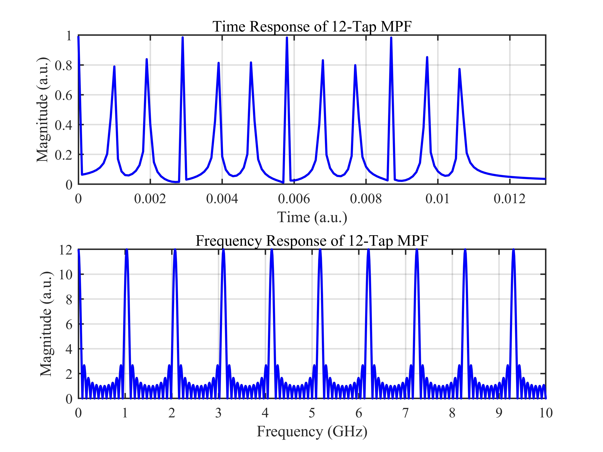
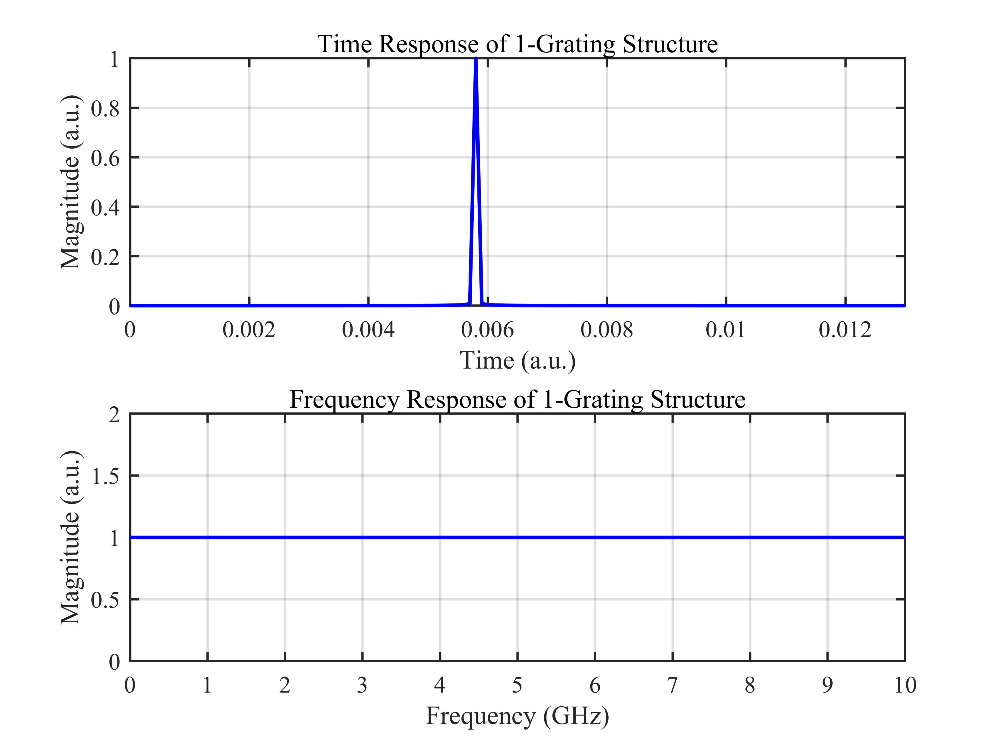

# 基于 WFBG 的级联光栅微波光子滤波器时频分析 / Cascaded WFBG-Based Microwave Photonic Filter Time-Frequency Analysis

## 1. 原理概述 / Principle

级联弱光纤布拉格光栅（WFBG）可构成微波光子滤波器（MPF）。每个 WFBG 作为一个抽头，其位置决定了信号往返时延。所有抽头的加权求和形成 MPF 的频率响应，IFFT 得到其时域脉冲响应。改变抽头数量或幅度分布可调控滤波器的频率选择特性。

A cascade of weak fiber Bragg gratings (WFBGs) forms a microwave photonic filter (MPF). Each WFBG acts as a tap, with its position determining the round-trip time delay. The weighted sum of all taps produces the MPF frequency response, and its IFFT yields the time-domain impulse response. Varying the tap number or amplitude distribution tailors the filters frequency selectivity.

### 核心公式 / Core Equations

**MPF 频率响应 / MPF Frequency Response:**

$$
H(\omega) = \sum_{k=1}^{N} a_k \cdot e^{-j\omega\tau_k}
$$

其中 $\tau_k = 2nL_k/c$ 为第 $k$ 个光栅的往返时延，$a_k$ 为幅度权重。

where $\tau_k = 2nL_k/c$ is the round-trip delay of the $k$-th grating, and $a_k$ is the amplitude weight.

**时域响应 / Time-Domain Response:**

$$
h(t) = \mathcal{F}^{-1}\{H(\omega)\}
$$

**自由光谱范围 / Free Spectral Range:**

$$
\text{FSR} = \frac{c}{2n\Delta L}
$$

其中 $\Delta L$ 为相邻光栅的间距。

where $\Delta L$ is the spacing between adjacent gratings.

---

## 2. 关键参数 / Key Parameters

| 参数 / Parameter | 符号 / Symbol | 值 / Value | 说明 / Description |
|------|------|------|------|
| 抽头数 | $N$ | 12 / 1 | WFBG 数量 / Number of WFBG taps |
| 光纤折射率 | $n$ | 1.4502 | 光纤有效折射率 / Effective refractive index |
| 抽头间距 | $\Delta L$ | 0.1 m | 相邻光栅间距 / Adjacent tap spacing |
| 幅度权重 | $a_k$ | 1 | 各抽头幅度权重 / Tap amplitude weights |
| 频率范围 | $f$ | 0 ~ 10 GHz | 扫描频率范围 / Frequency sweep range |

---

## 3. 仿真结果 / Simulation Results

### 3.1 12 抽头 MPF 的时域与频域响应 / Time and Frequency Response of 12-Tap MPF

> $N = 12$, $a_k = 1$, $\Delta L = 0.1$ m，等间隔均匀抽头

### 3.2 单个光栅结构的时域与频域响应 / Time and Frequency Response of Single Grating

> $N = 1$, $a_k = 1$, $L = 0.6$ m

---

*更多算法请返回 [F:\GitHub](../../README.md).*
