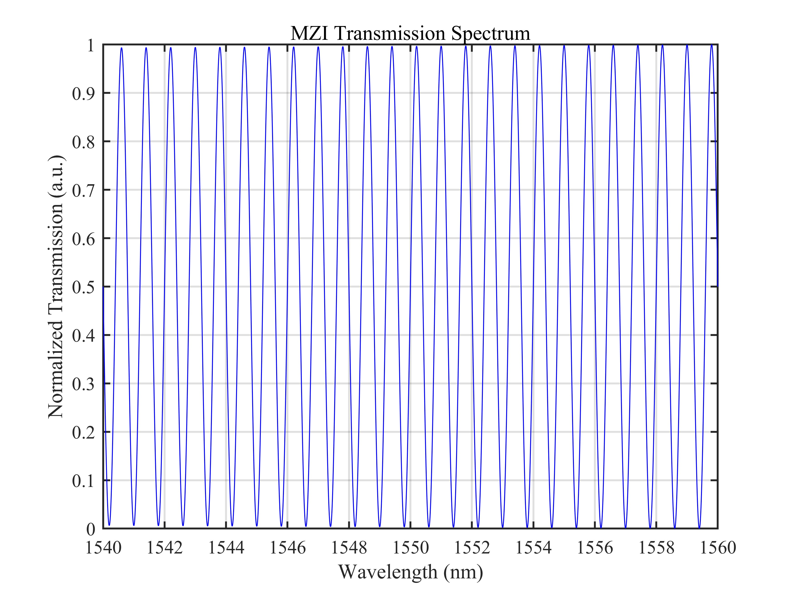
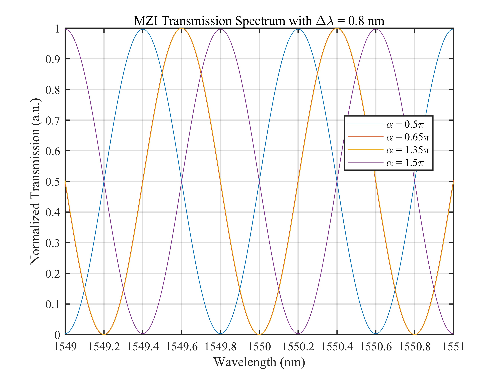
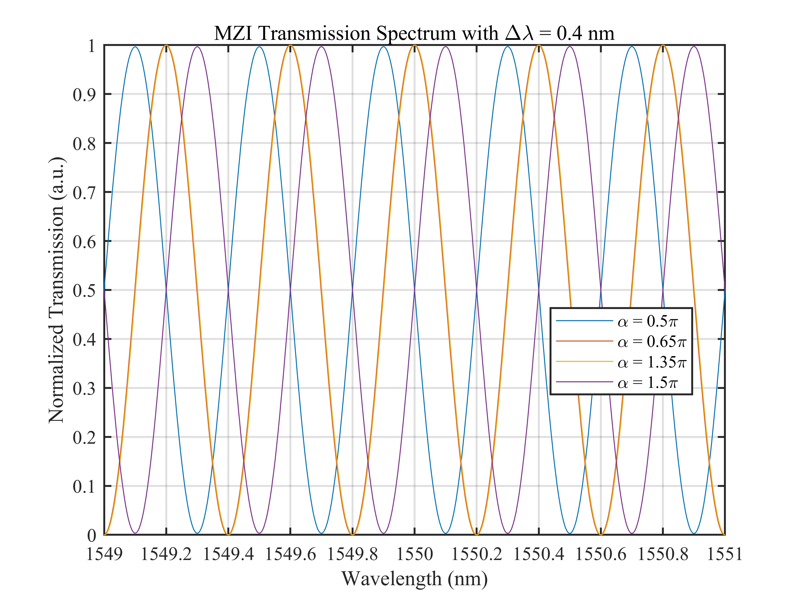
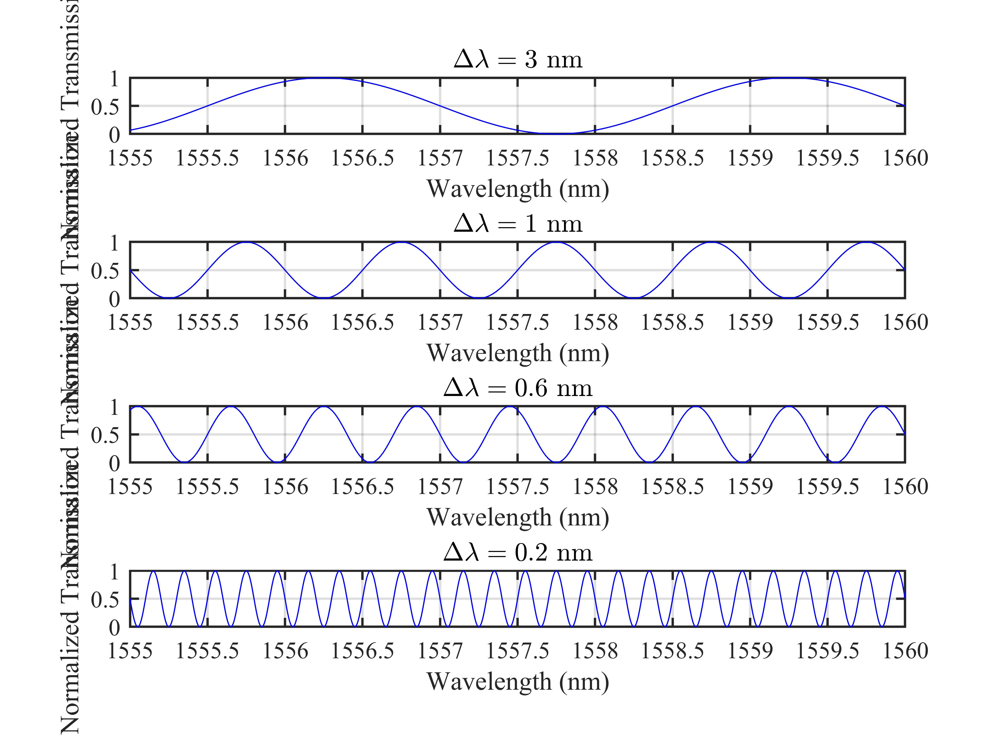
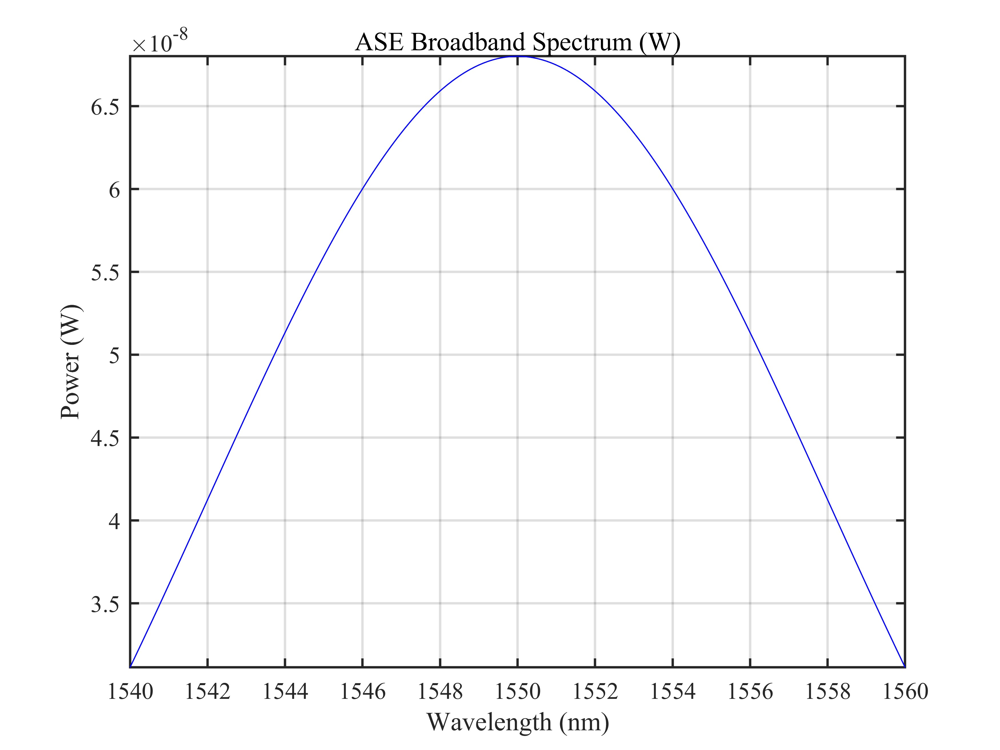
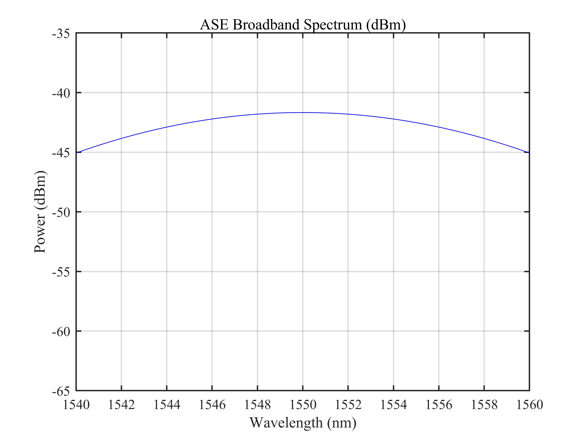
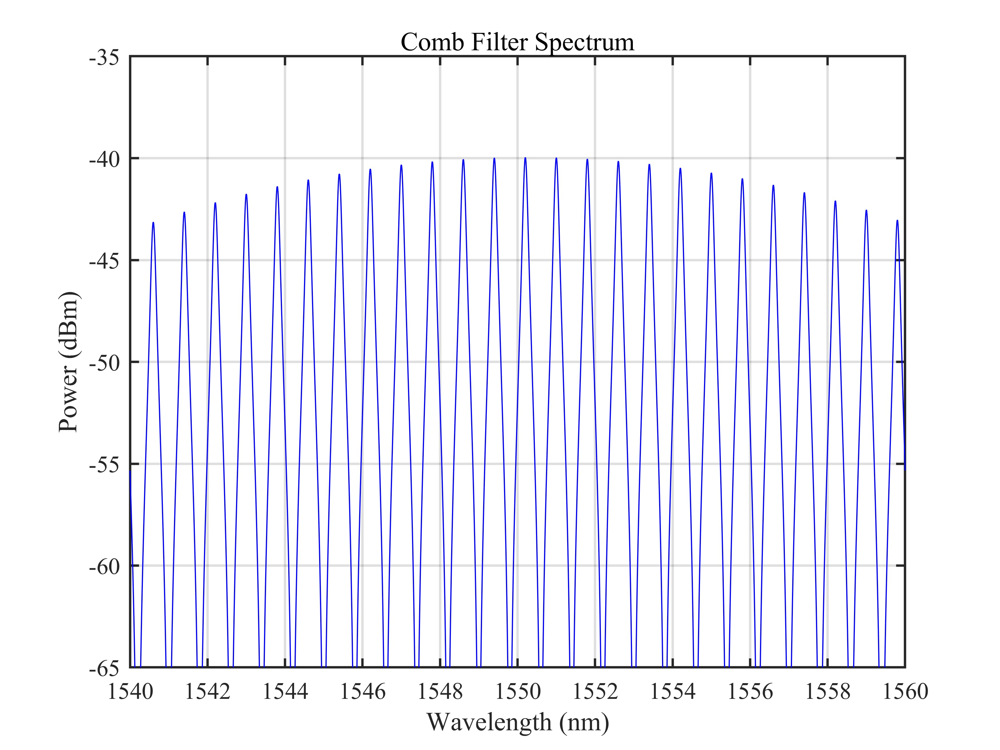
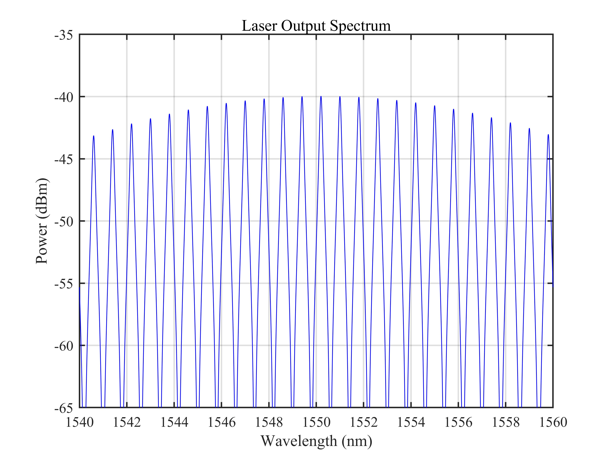

# 基于 MZI 的光纤激光器仿真 / MZI-Based Fiber Laser Simulation

## 1. 原理概述 / Principle

马赫-曾德尔干涉仪（Mach-Zehnder Interferometer, MZI）是一种基于光波干涉原理的光学器件，广泛应用于光纤通信和传感领域。其基本结构包含两个耦合器和两个不等长的干涉臂，通过两臂之间的相位差实现波长选择性输出。当 MZI 与掺铒光纤（EDF）增益介质结合构成环形激光腔时，MZI 的梳状透射谱作为波长选择元件，配合 EDF 的宽带放大特性，可在特定波长处产生激光输出。

本仿真使用琼斯矩阵方法描述 MZI 中偏振光的传输特性，分析角度参数 $\alpha$ 和透射谱周期 $\Delta\lambda$ 对透射谱的影响，并通过增益循环（50 轮）模拟光纤激光器的建立过程。

The Mach-Zehnder Interferometer (MZI) is an optical device based on light interference, widely used in optical fiber communications and sensing. Its basic structure consists of two couplers and two unequal-length interferometer arms, achieving wavelength-selective output through the phase difference between the arms. When combined with an Erbium-Doped Fiber (EDF) gain medium to form a ring laser cavity, the MZI's comb-like transmission spectrum serves as the wavelength-selective element, leveraging the broadband amplification of EDF to achieve laser output at specific wavelengths.

This simulation uses the Jones matrix method to describe polarization-dependent light propagation in the MZI, analyzes the effects of angle parameter $\alpha$ and transmission period $\Delta\lambda$ on the transmission spectrum, and simulates the fiber laser establishment process through gain cycling (50 round trips).

### 核心公式 / Core Equations

**MZI 透射谱 / MZI Transmission Spectrum:**

$$
T = \frac{1}{2}\bigl[1 - \cos(\alpha + \theta)\cos\theta\cos\phi_x - \sin(\alpha + \theta)\sin\theta\cos\phi_y\bigr]
$$

其中 $\alpha$ 为相位角，$\theta$ 为固定相位偏移，$\phi_x$ 和 $\phi_y$ 分别为 x 和 y 偏振方向的相位延迟。

where $\alpha$ is the phase angle, $\theta$ is the fixed phase offset, and $\phi_x$, $\phi_y$ are the phase delays in the x and y polarization directions, respectively.

**相位延迟 / Phase Delay:**

$$
\phi_{x,y} = \frac{2\pi n_{x,y} \Delta L}{\lambda}
$$

$$
\Delta L = \frac{\lambda^2}{n \Delta\lambda}
$$

其中 $n_{x,y}$ 为双折射介质中两个偏振方向的折射率，$\Delta L$ 为臂长差，$\Delta\lambda$ 为透射谱周期。

where $n_{x,y}$ are the refractive indices for the two polarization directions in the birefringent medium, $\Delta L$ is the arm length difference, and $\Delta\lambda$ is the transmission spectrum period.

**EDF 增益 / EDF Gain:**

$$
G_{\text{dB}} = \gamma \cdot L_{\text{EDF}} \cdot 0.3
$$

其中 $\gamma$ 为增益系数，$L_{\text{EDF}}$ 为 EDF 长度。

where $\gamma$ is the gain coefficient and $L_{\text{EDF}}$ is the EDF length.

---

## 2. 关键参数 / Key Parameters

| 参数 / Parameter | 符号 / Symbol | 典型值 / Value | 说明 / Description |
|------|------|------|------|
| 光纤折射率 | $n$ | 1.45 | 光纤纤芯折射率 / Fiber core refractive index |
| 双折射系数 | $\Delta n$ | $10^{-6}$ | 纤芯双折射 / Core birefringence |
| 波长范围 | $\lambda$ | 1540-1560 nm | 仿真光谱范围 / Simulation spectral range |
| 采样点数 | $N$ | 10001 | 波长离散点数 / Wavelength sampling points |
| 固定相位角 | $\theta$ | $\pi/4$ | 固定相位偏移 / Fixed phase offset |
| 角度参数 | $\alpha$ | $0.5\pi$–$1.5\pi$ | 可调相位角 / Tunable phase angle |
| 透射谱周期 | $\Delta\lambda$ | 0.2–3.0 nm | MZI 透射谱周期 / MZI transmission period |
| 宽谱光功率 | $P_0$ | $6.8\times10^{-8}$ W | ASE 宽谱光源功率 / ASE source power |
| 中心波长 | $\lambda_c$ | 1550 nm | ASE 光谱中心波长 / ASE center wavelength |
| 光谱带宽 | $\Delta\lambda_{\text{ASE}}$ | 8 nm | ASE 光谱 3 dB 带宽 / ASE spectral bandwidth |
| 增益系数 | $\gamma$ | 0.3 dB/m | EDF 增益系数 / EDF gain coefficient |
| EDF 长度 | $L_{\text{EDF}}$ | 2 m | 掺铒光纤长度 / EDF length |
| 输出耦合比 | $R$ | 10% | 输出耦合器分光比 / Output coupler ratio |
| 循环次数 | $N_{\text{cyc}}$ | 50 | 激光腔增益循环次数 / Laser cavity round trips |

## 3. 仿真结果 / Simulation Results

> 以下仿真结果展示了基于 MZI 的光纤激光器的透射谱特性和激光建立过程。图 1-4 分析 MZI 在不同参数下的透射谱特征，图 5-6 展示 ASE 宽谱光源，图 7-8 展示梳状滤波后的光谱和最终的激光器输出。

### 3.1 MZI 透射谱 / MZI Transmission Spectrum

> 在 $\Delta\lambda = 0.8$ nm 条件下的 MZI 透射谱，波长范围 1540-1560 nm

### 3.2 不同 $\alpha$ 下的透射谱（$\Delta\lambda = 0.8$ nm）/ Transmission Spectra with Different $\alpha$ ($\Delta\lambda = 0.8$ nm)

> 四个不同 $\alpha$ 值 ($0.5\pi$, $0.65\pi$, $1.35\pi$, $1.5\pi$) 在 $\Delta\lambda = 0.8$ nm 下的透射谱对比，波长范围 1549-1551 nm

### 3.3 不同 $\alpha$ 下的透射谱（$\Delta\lambda = 0.4$ nm）/ Transmission Spectra with Different $\alpha$ ($\Delta\lambda = 0.4$ nm)

> 四个不同 $\alpha$ 值在 $\Delta\lambda = 0.4$ nm 下的透射谱对比，波长范围 1549-1551 nm

### 3.4 不同周期下的透射谱对比 / Transmission Spectra with Different Periods

> 四个不同周期 ($\Delta\lambda = 3.0, 1.0, 0.6, 0.2$ nm) 下的透射谱对比，波长范围 1555-1560 nm

### 3.5 ASE 宽谱光源光谱 / ASE Broadband Spectrum

> EDF 产生的宽谱 ASE 光源，中心波长 1550 nm，带宽 8 nm，以 W（图 5）和 dBm（图 6）两种单位显示

### 3.6 梳状滤波光谱与激光器输出 / Comb Filter Spectrum and Laser Output

> 经 MZI 梳状滤波后的光谱（图 7）和经过 50 轮增益循环后的最终激光器输出光谱（图 8）

---

*更多算法请返回 [F:\GitHub](../../README.md).*
